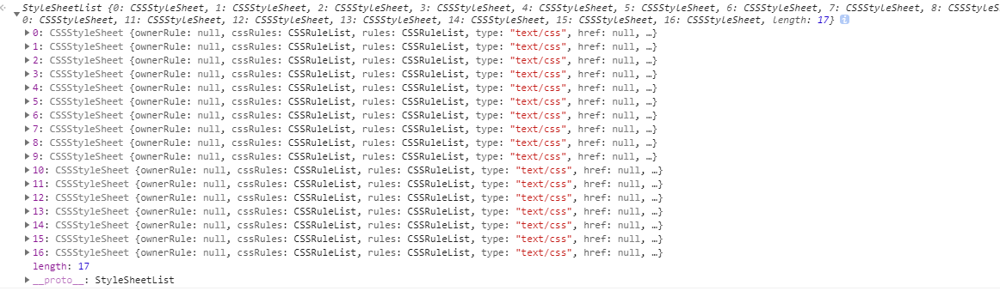

# 渲染流程


渲染流程就是将HTML,CSS,JavaScript文件转化成漂亮页面的过程

## DOM 生成

为什么要构建 DOM 树呢？**这是因为浏览器无法直接理解和使用 HTML，所以需要将 HTML 转换为浏览器能够理解的结构——DOM 树**。

## 样式计算

样式计算的目的是为了计算出 DOM 节点中每个元素的具体样式，这个阶段大体可分为三步来完成。

### 1. 把 CSS 转换为浏览器能够理解的结构

CSS 样式来源主要有三种：

- 通过 link 引用的外部 CSS 文件
- `<style>`标记内的 CSS
- 元素的 style 属性内嵌的 CSS

和 HTML 文件一样，浏览器也是无法直接理解这些纯文本的 CSS 样式，所以**当渲染引擎接收到 CSS 文本时，会执行一个转换操作，将 CSS 文本转换为浏览器可以理解的结构——styleSheets**。

只需要在控制台中输入 document.styleSheets，然后就看到如下图所示的结构：



### 2. 转换样式表中的属性值，使其标准化

**需要将所有值转换为渲染引擎容易理解的、标准化的计算值**，这个过程就是属性值标准化。


### 3. 计算出 DOM 树中每个节点的具体样式

#### CSS 的继承规则

  **CSS 继承就是每个 DOM 节点都包含有父节点的样式**。

#### **CSS的层叠规则**

**层叠是 CSS 的一个基本特征，它是一个定义了如何合并来自多个源的属性值的算法。它在 CSS 处于核心地位，CSS 的全称“层叠样式表”正是强调了这一点**。

## 布局阶段

现在，我们有 DOM 树和 DOM 树中元素的样式，但这还不足以显示页面，因为我们还不知道 DOM 元素的几何位置信息。**那么接下来就需要计算出 DOM 树中可见元素的几何位置，我们把这个计算过程叫做布局**。

### 1. 创建布局树

为了构建布局树，浏览器大体上完成了下面这些工作：

- 遍历 DOM 树中的所有可见节点，并把这些节点加到布局中；
- 而不可见的节点会被布局树忽略掉，如 head 标签下面的全部内容，再比如 body.p.span 这个元素，因为它的属性包含 dispaly:none，所以这个元素也没有被包进布局树。

### 2. 布局计算

#### 现在的布局计算 LayoutTree

#### 下一代布局计算 LayoutNG

在执行布局操作的时候，会把布局运算的结果重新写回布局树中，所以布局树既是输入内容也是输出内容，这是布局阶段一个不合理的地方，因为在布局阶段并没有清晰地将输入内容和输出内容区分开来。针对这个问题，Chrome 团队正在重构布局代码，下一代布局系统叫 LayoutNG，试图更清晰地分离输入和输出，从而让新设计的布局算法更加简单。

## 生成 LayerTree

因为页面中有很多复杂的效果，如一些复杂的 3D 变换、页面滚动，或者使用 z-indexing 做 z 轴排序等，为了更加方便地实现这些效果，**渲染引擎还需要为特定的节点生成专用的图层，并生成一棵对应的图层树**（LayerTree）。

### 那么需要满足什么条件，渲染引擎才会为特定的节点创建新的层呢?

#### **第一点，拥有层叠上下文属性的元素会被提升为单独的一层。**

- 档根元素（`<html>`）；
- [`position`](https://developer.mozilla.org/zh-CN/docs/Web/CSS/position) 值为 `absolute`（绝对定位）或 `relative`（相对定位）且 [`z-index`](https://developer.mozilla.org/zh-CN/docs/Web/CSS/z-index) 值不为 `auto` 的元素；
- [`position`](https://developer.mozilla.org/zh-CN/docs/Web/CSS/position) 值为 `fixed`（固定定位）或 `sticky`（粘滞定位）的元素（沾滞定位适配所有移动设备上的浏览器，但老的桌面浏览器不支持）；
- flex ([`flexbox`](https://developer.mozilla.org/zh-CN/docs/Web/CSS/flexbox)) 容器的子元素，且 [`z-index`](https://developer.mozilla.org/zh-CN/docs/Web/CSS/z-index) 值不为 `auto`；
- grid ([`grid`](https://developer.mozilla.org/zh-CN/docs/Web/CSS/grid)) 容器的子元素，且 [`z-index`](https://developer.mozilla.org/zh-CN/docs/Web/CSS/z-index) 值不为 `auto`；
- [`opacity`](https://developer.mozilla.org/zh-CN/docs/Web/CSS/opacity) 属性值小于 `1` 的元素（参见 [the specification for opacity](http://www.w3.org/TR/css3-color/#transparency)）；
- [`mix-blend-mode`](https://developer.mozilla.org/zh-CN/docs/Web/CSS/mix-blend-mode) 属性值不为 `normal` 的元素；
- 以下任意属性值不为 `none` 的元素：
  - [`transform`](https://developer.mozilla.org/zh-CN/docs/Web/CSS/transform)
  - [`filter`](https://developer.mozilla.org/zh-CN/docs/Web/CSS/filter)
  - [`perspective`](https://developer.mozilla.org/zh-CN/docs/Web/CSS/perspective)
  - [`clip-path`](https://developer.mozilla.org/zh-CN/docs/Web/CSS/clip-path)
  - [`mask`](https://developer.mozilla.org/zh-CN/docs/Web/CSS/mask) / [`mask-image`](https://developer.mozilla.org/zh-CN/docs/Web/CSS/mask-image) / [`mask-border`](https://developer.mozilla.org/zh-CN/docs/Web/CSS/mask-border)
- [`isolation`](https://developer.mozilla.org/zh-CN/docs/Web/CSS/isolation) 属性值为 `isolate` 的元素；
- [`-webkit-overflow-scrolling`](https://developer.mozilla.org/zh-CN/docs/Web/CSS/-webkit-overflow-scrolling) 属性值为 `touch` 的元素；
- [`will-change`](https://developer.mozilla.org/zh-CN/docs/Web/CSS/will-change) 值设定了任一属性而该属性在 non-initial 值时会创建层叠上下文的元素（参考[这篇文章](http://dev.opera.com/articles/css-will-change-property/)）；
- [`contain`](https://developer.mozilla.org/zh-CN/docs/Web/CSS/contain) 属性值为 `layout`、`paint` 或包含它们其中之一的合成值（比如 `contain: strict`、`contain: content`）的元素。

#### **第二点，需要剪裁（clip）的地方也会被创建为图层。**

```js
      div {
            width: 200;
            height: 200;
            overflow:auto;
            background: gray;
        }
```

出现这种裁剪情况的时候，渲染引擎会为文字部分单独创建一个层，如果出现滚动条，滚动条也会被提升为单独的层

### 图层绘制

渲染引擎实现图层的绘制，会把一个图层的绘制拆分成很多小的**绘制指令**，然后再把这些指令按照顺序组成一个待绘制列表，

### 栅格化（raster）操作

绘制列表只是用来记录绘制顺序和绘制指令的列表，而实际上绘制操作是由渲染引擎中的合成线程来完成的。

在有些情况下，有的图层可以很大，比如有的页面你使用滚动条要滚动好久才能滚动到底部，但是通过视口，用户只能看到页面的很小一部分，所以在这种情况下，要绘制出所有图层内容的话，就会产生太大的开销，而且也没有必要。

基于这个原因，**合成线程会将图层划分为图块（tile）**，

然后**合成线程会按照视口附近的图块来优先生成位图，实际生成位图的操作是由栅格化来执行的。所谓栅格化，是指将图块转换为位图**。而图块是栅格化执行的最小单位。

通常，栅格化过程都会使用 GPU 来加速生成，使用 GPU 生成位图的过程叫快速栅格化，或者 GPU 栅格化，生成的位图被保存在 GPU 内存中。

GPU 操作是运行在 GPU 进程中，如果栅格化操作使用了 GPU，那么最终生成位图的操作是在 GPU 中完成的，这就涉及到了跨进程操作。渲染进程把生成图块的指令发送给 GPU，然后在 GPU 中执行生成图块的位图，并保存在 GPU 的内存中。

### 合成和显示

一旦所有图块都被光栅化，合成线程就会生成一个绘制图块的命令——“DrawQuad”，然后将该命令提交给浏览器进程。

浏览器进程里面有一个叫 viz 的组件，用来接收合成线程发过来的 DrawQuad 命令，然后根据 DrawQuad 命令，将其页面内容绘制到内存中，最后再将内存显示在屏幕上。


综合上图，我们总结下渲染进程的流程：

1. 渲染引擎将HTML内容转化成可以读懂的**DOM结构**
2. 将CSS文件转化成**styleSheets**，计算出DOM节点样式
3. 合并生成**loyoutTree**
4. 按照不同的层叠上下文进行分层，创建不同图层
5. 把一个图层的绘制拆分成很多小的**绘制指令**并将其提交到合成线程
6. 合成线程将图层分成**图块**，并在**光栅化线程池**中将图块转换成位图。 
7. 生成绘制命令-“**DrawQuad**”，发送到浏览器进程
8. viz组件将内容绘制到内存，并显示到显示器上

## 重绘、重排和合成

### 重排

如果你通过 JavaScript 或者 CSS 修改元素的几何位置属性，例如改变元素的宽度、高度等，那么浏览器会触发重新布局，解析之后的一系列子阶段，这个过程就叫**重排**。无疑，**重排需要更新完整的渲染流水线，所以开销也是最大的**。

### 重绘

如果修改了元素的背景颜色，那么布局阶段将不会被执行，因为并没有引起几何位置的变换，所以就直接进入了绘制阶段，然后执行之后的一系列子阶段，这个过程就叫**重绘**。相较于重排操作，**重绘省去了布局和分层阶段，所以执行效率会比重排操作要高一些**。

### 合成

如果你更改一个既不要布局也不要绘制的属性，渲染引擎将跳过布局和绘制，只执行后续的合成操作，我们把这个过程叫做**合成**。

使用 CSS 的 transform 来实现动画效果，这可以避开重排和重绘阶段，直接在非主线程上执行合成动画操作。这样的效率是最高的，因为是在非主线程上合成，并没有占用主线程的资源，另外也**避开了布局和绘制**两个子阶段，所以**相对于重绘和重排，合成能大大提升绘制效率**。‘


## 优化方向

- 像js等请求后置，避免阻塞关键路径渲染
- 动画脱离文档流，使用RAF，避免造成重排
- 使用 class 操作样式，而不是频繁操作 style
- 批量进行DOM操作


