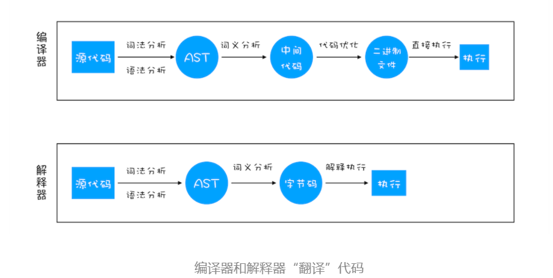
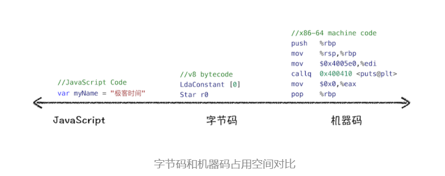
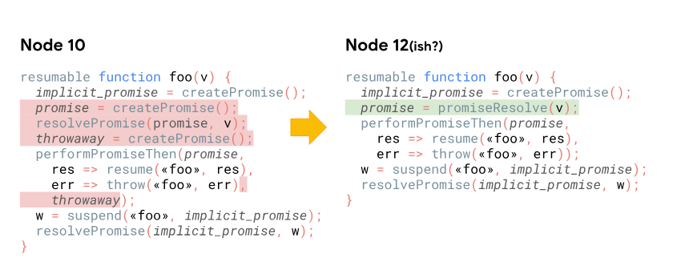
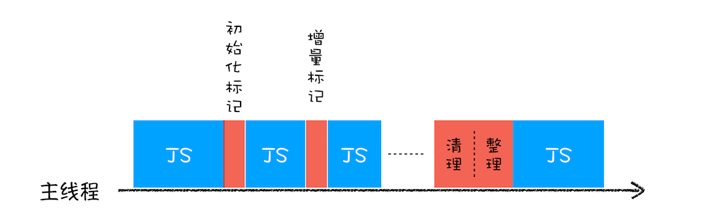

# V8


## 函数即对象

函数除了可以拥有常用类型的属性值之外，还拥有两个隐藏属性，分别是 name 属性和 code 属性。隐藏 name 属性的值就是函数名称，如果某个函数没有设置函数名，该函数对象的默认的 name 属性值就是 anonymous。

### 函数是一等公民

因为函数是一种特殊的对象，所以在 JavaScript 中，函数可以赋值给一个变量，也可以作为函数的参数，还可以作为函数的返回值。**如果某个编程语言的函数，可以和这个语言的数据类型做一样的事情，我们就把这个语言中的函数称为一等公民**。

### 对象的属性

#### **排序属性**和常规属性

我们把对象中的数字属性称为**排序属性**，在 V8 中被称为 **elements**，字符串属性就被称为**常规属性**，在 V8 中被称为 **properties**

**数字属性按照索引值大小升序排列，字符串属性根据创建时的顺序升序排列。**

#### 快属性和慢属性

将不同的属性分别保存到 elements 属性和 properties 属性中，无疑简化了程序的复杂度，但是在查找元素时，却多了一步操作，基于这个原因，V8 采取了一个权衡的策略以加快查找属性的效率，这个策略是将部分常规属性直接存储到对象本身，我们把这称为**对象内属性 (in-object properties)。**

通常，我们将保存在线性数据结构中的属性称之为“**快属性**”，因为线性数据结构中只需要通过索引即可以访问到属性，虽然访问线性结构的速度快，但是如果从线性结构中添加或者删除大量的属性时，则执行效率会非常低，这主要因为会产生大量时间和内存开销。不过对象内属性的数量是固定的，默认是 10 个，

如果一个对象的属性过多时，V8 就会采取另外一种存储策略，那就是“**慢属性**”策略，但慢属性的对象内部会有独立的非线性数据结构 (词典) 作为属性存储容器。所有的属性元信息不再是线性存储的，而是**直接保存在属性字典**中。


#### 内存查看

```js
function Foo(property_num, element_num) {
  //添加可索引属性
  for (let i = 0; i < element_num; i++) {
    this[i] = `element${i}`;
  }
  //添加常规属性
  for (let i = 0; i < property_num; i++) {
    let ppt = `property${i}`;
    this[ppt] = ppt;
  }
}
var bar = new Foo(10, 10);
```

Chrome 开发者工具切换到 Memory 标签，然后点击左侧的小圆圈就可以捕获当前的内存快照,查看创建不同数量属性的内存存储区别

// todo:和老师讲的有点不一样

## 类型系统

### V8 是怎么执行加法操作的？

1. 把第一个表达式 (AdditiveExpression) 的值赋值给左引用 (lref)。
2. 使用 GetValue(lref) 获取左引用 (lref) 的计算结果，并赋值给左值。
3. 使用 ReturnIfAbrupt(lval) 如果报错就返回错误。
4. 把第二个表达式 (MultiplicativeExpression) 的值赋值给右引用 (rref)。
5. 使用 GetValue(rref) 获取右引用 (rref) 的计算结果，并赋值给 rval。
6. 使用 ReturnIfAbrupt(rval) 如果报错就返回错误。
7. 使用 ToPrimitive(lval) 获取左值 (lval) 的计算结果，并将其赋值给左原生值 (lprim)。
8. 使用 ToPrimitive(rval) 获取右值 (rval) 的计算结果，并将其赋值给右原生值 (rprim)。
9. 如果 Type(lprim) 和 Type(rprim) 中有一个是 String，则：
   - 把 ToString(lprim) 的结果赋给左字符串 (lstr)；
   - 把 ToString(rprim) 的结果赋给右字符串 (rstr)；
   - 返回左字符串 (lstr) 和右字符串 (rstr) 拼接的字符串。
10. 把 ToNumber(lprim) 的结果赋给左数字 (lnum)。
11. 把 ToNumber(rprim) 的结果赋给右数字 (rnum)。
12. 返回左数字 (lnum) 和右数字 (rnum) 相加的数值。

通俗地理解，V8 会提供了一个 ToPrimitve 方法，其作用是将 a 和 b 转换为原生数据类型，其转换流程如下：

- 先检测该对象中是否存在 valueOf 方法，如果有并返回了原始类型，那么就使用该值进行强制类型转换；

- 如果 valueOf 没有返回原始类型，那么就使用 toString 方法的返回值；

- 如果 vauleOf 和 toString 两个方法都不返回基本类型值，便会触发一个 TypeError 的错误。

  

在执行加法操作的时候，V8 会通过 ToPrimitve 方法将对象类型转换为原生类型，最后就是两个原生类型相加，

- 如果其中一个值的类型是字符串时，则另一个值也需要强制转换为字符串，然后做字符串的连接运算。

- 在其他情况时，所有的值都会转换为数字类型值，然后做数字的相加。

## 编译器和解释器

**编译型语言在程序执行之前，需要经过编译器的编译过程，并且编译之后会直接保留机器能读懂的二进制文件，这样每次运行程序时，都可以直接运行该二进制文件，而不需要再次重新编译了**。比如 C/C++、GO 等都是编译型语言。

**而由解释型语言编写的程序，在每次运行时都需要通过解释器对程序进行动态解释和执行**。比如 Python、JavaScript 等都属于解释型语言。



### V8 执行 JavaScript 代码

#### 生成抽象语法树（AST）和执行上下文

将源代码转换为**抽象语法树**，并生成**执行上下文**。 AST 看成代码的结构化的表示，编译器或者解释器后续的工作都需要依赖于 AST，而不是源代码。AST 应用中最著名的一个项目是 Babel。Babel 的工作原理就是先将 ES6 源码转换为 AST，然后再将 ES6 语法的 AST 转换为 ES5 语法的 AST，最后利用 ES5 的 AST 生成 JavaScript 源代码。

1. **分词（tokenize），又称为词法分析**，其作用是将一行行的源码拆解成一个个 token。

```js
var myName = "xiaopang";
// token : var 、 myName 、= 、 'xiaopang'
```

2. **解析（parse），又称为语法分析**，其作用是将上一步生成的 token 数据，根据语法规则转为 AST。

#### 生成字节码



由于执行机器码的效率是非常高效的，所以早期 chorme 直接将 AST 转化成机器码进行保存。

但机器码占用内存过大，为了解决内存占用问题，V8 团队大幅重构了引擎架构，引入字节码。

**字节码就是介于 AST 和机器码之间的一种代码。但是与特定类型的机器码无关，字节码需要通过解释器将其转换为机器码后才能执行。**

#### 执行代码

通常，如果有一段第一次执行的字节码，解释器 Ignition 会逐条解释执行。在执行字节码的过程中，如果发现有热点代码（HotSpot），比如一段代码被重复执行多次，这种就称为**热点代码**，那么后台的编译器 TurboFan 就会把该段**热点的字节码**编译为**高效的机器码**，然后当再次执行这段被优化的代码时，只需要执行编译后的机器码就可以了，这样就大大提升了代码的执行效率。我们把这种技术称之为**即时编译（JIT）**

## 微任务

MutationObserver 和 IntersectionObserver 两个性质应该差不多。我这里简称 ob。ob 是一个微任务，通过浏览器的 requestIdleCallback，在浏览器每一帧的空闲时间执行 ob 监听的回调，该监听是不影响主线程的，但是回调会阻塞主线程。当然有一个限制，如果 100ms 内主线程一直处于未空闲状态，那会强制触发 ob。

### 协程

协程是一种比线程更加轻量级的存在。你可以把协程看成是跑在线程上的任务，一个线程上可以存在多个协程，但是在线程上同时只能执行一个协程。最重要的是，协程不是被操作系统内核所管理，而完全是由程序所控制（也就是在用户态执行）。这样带来的好处就是性能得到了很大的提升，不会像线程切换那样消耗资源。

### Async 和 await 的优化

性能提升取决于以下三个因素：

- TurboFan，新的优化编译器 🎉
- Orinoco，新的垃圾回收器 🚛
- 一个 Node.js 8 的 bug 导致 await 跳过了一些微 tick（microticks） 🐛

#### bug 优化

```js
const p = Promise.resolve();

(async () => {
  await p;
  console.log("after:await");
})();

p.then(() => console.log("tick:a")).then(() => console.log("tick:b"));
```

通过判断 await 后的 是否是一个 Promise，如果是的话直接返回，可以节省一个 Promise，只封装必要的 promise。这个操作在值已经是 promose 的情况下可以省去一个额外的 promise 和两个微任务。

#### 去除了 throwaway



[「译」更快的 async 函数和 promises](https://mp.weixin.qq.com/s?__biz=MzUzNjk5MTE1OQ==&mid=2247488356&idx=1&sn=2f17461b11dcf6a8365a2488d7e25945&chksm=faec97bccd9b1eaa108a03c3bfde45944a3b6b766154bc1f2b67706decfbcc7300b03eb54d46&mpshare=1&scene=1&srcid=09285usyMosTYJPNjtBC8aBC&sharer_sharetime=1601257327974&sharer_shareid=12302458a55e6884c1bb1c47ff44880d&key=a5121dd1fbb299a4574b60008a7892715083167693e8e0e07a0ea940e7a39419e895c9b1b0ebc446a53ca95dcaf5eab4b6a36628ad873096de1719747022b983bf12d8b2773a40f206a5271e184c1cd0cf893260303fd38da8e48d9e6ac7b8f577ddd2ec049a147d51b1de5beafec1a50a681a0466cebea7415e7d883c9fef58&ascene=1&uin=MTIwOTc2NTAyMQ%3D%3D&devicetype=Windows+10+x64&version=62090529&lang=zh_CN&exportkey=AXMYmDf2JEdNIm7d3TuwrRs%3D&pass_ticket=f%2BX7SDG7or8VWYKhna8jJ88M0v3Zv9Whtox6Rc4ZhhErghEtyOr5KNMpaF%2BaWmW3&wx_header=0)

## 垃圾回收

**原始数据类型是存储在栈空间中的，引用类型的数据是存储在堆空间中的**。通过这种分配方式，我们解决了数据的内存分配的问题。

不过有些数据被使用之后，可能就不再需要了，我们把这种数据称为**垃圾数据**。如果这些垃圾数据一直保存在内存中，那么内存会越用越多，所以我们需要**对这些垃圾数据进行回收，以释放有限的内存空间**。

JS 有垃圾处理器，所以无需手动回收内存，而是由垃圾处理器自动处理。譬如对于那些执行完毕的函数，如果没有外部引用（被引用的话会形成闭包），则会回收。

### 回收规则

常用的两种垃圾回收规则是：**标记清除** 和 **引用计数**

Javascript 引擎基础 GC 方案是：标记清除

#### 标记清除

简单解释为：

1. 遍历所有可访问的对象。
2. 回收已不可访问的对象。

#### 引用计数

**跟踪记录每个值被引用的次数，当一个值被引用时，次数`+1`，减持时`-1`，下次垃圾回收器会回收次数为`0`的值的内存（当然了，容易出循环引用的 bug）**

### 调用栈中的数据回收

```js
function foo() {
  var a = 1;
  var b = { name: " 测试 " };
  function showName() {
    var c = " 测试一下 ";
    var d = { name: " 测试一下 " };
  }
  showName();
}
foo();
```

js 引擎 将 showName 函数 的执行上下文 压入 调用栈的同时，还有一个**记录当前执行状态的指针（称为 ESP）**，指向调用栈中 showName 函数的执行上下文。

当函数执行完毕后，JavaScript 就会将指针下移，同时进行 showName 函数执行上下文的销毁

所以说，当一个函数执行结束之后，**JavaScript 引擎会通过向下移动 ESP 来销毁该函数保存在栈中的执行上下文**。

### 堆中的数据回收

当上面那段代码的 foo 函数执行结束之后，ESP 应该是指向全局执行上下文的，那这样的话，showName 函数和 foo 函数的执行上下文就处于无效状态了，不过保存在堆中的两个对象依然占用着空间，

#### **代际假说**

**代际假说**有以下两个特点：

- 第一个是大部分对象在内存中存在的时间很短，简单来说，就是很多对象一经分配内存，很快就变得不可访问；
- 第二个是不死的对象，会活得更久。

在 V8 中会把堆分为**新生代**和**老生代**两个区域，**新生代中存放的是生存时间短的对象，老生代中存放的生存时间久的对象**。

新生区通常只支持 1 ～ 8M 的容量，而老生区支持的容量就大很多了。对于这两块区域，V8 分别使用两个不同的垃圾回收器，以便更高效地实施垃圾回收。

- **副垃圾回收器，主要负责新生代的垃圾回收。**
- **主垃圾回收器，主要负责老生代的垃圾回收。**

#### 工作流程

其实**不论什么类型的垃圾回收器，它们都有一套共同的执行流程**。

1. **标记**空间中活动对象和非活动对象。所谓活动对象就是还在使用的对象，非活动对象就是可以进行垃圾回收的对象。
2. **回收**非活动对象所占据的内存。其实就是在所有的标记完成之后，统一清理内存中所有被标记为可回收的对象。
3. 做**内存整理**。一般来说，频繁回收对象后，内存中就会存在大量不连续空间，我们把这些不连续的内存空间称为**内存碎片**。当内存中出现了大量的内存碎片之后，如果需要分配较大连续内存的时候，就有可能出现内存不足的情况。所以最后一步需要整理这些内存碎片，但这步其实是可选的，因为有的垃圾回收器不会产生内存碎片，比如接下来我们要介绍的副垃圾回收器。

#### 副垃圾回收器

副垃圾回收器主要负责新生区的垃圾回收。而通常情况下，大多数小的对象都会被分配到新生区，所以说这个区域虽然**不大**，但是垃圾回收还是比较**频繁**的。

新生代中用**Scavenge 算法**来处理。所谓 Scavenge 算法，是把新生代空间对半划分为两个区域，一半是对象区域，一半是空闲区域。

**新加入的对象**都会存放到**对象区域**，当对象区域快被写满时，就需要执行一次垃圾清理操作。

在垃圾回收过程中，首先要对对象区域中的垃圾做标记；标记完成之后，就进入垃圾清理阶段，副垃圾回收器会把这些存活的对象复制到空闲区域中，同时它还会把这些对象有序地排列起来，所以这个复制过程，也就相当于完成了内存整理操作，复制后空闲区域就没有内存碎片了。

完成复制后，对象区域与空闲区域进行角色翻转，也就是原来的对象区域变成空闲区域，原来的空闲区域变成了对象区域。这样就完成了垃圾对象的回收操作，同时这种**角色翻转的操作还能让新生代中的这两块区域无限重复使用下去**。

由于新生代中采用的 Scavenge 算法，所以每次执行清理操作时，都需要将存活的对象从对象区域复制到空闲区域。但复制操作需要时间成本，如果新生区空间设置得太大了，那么每次清理的时间就会过久，所以**为了执行效率，一般新生区的空间会被设置得比较小**。

也正是因为新生区的空间不大，所以很容易被存活的对象装满整个区域。为了解决这个问题，JavaScript 引擎采用了**对象晋升策略**，也就是**经过两次垃圾回收**依然还存活的对象，会被移动到老生区中

#### 主垃圾回收器

主垃圾回收器主要负责老生区中的垃圾回收。除了新生区中晋升的对象，一些大的对象会直接被分配到老生区。因此老生区中的对象有两个特点，一个是**对象占用空间大**，另一个是**对象存活时间长**。

主垃圾回收器 考虑晋升的都是大对象，复制会花费时间多，所以采用**标记 - 清除（Mark-Sweep）**的算法进行垃圾回收。

1. 标记阶段从一组根元素开始，递归遍历这组根元素，在这个遍历过程中，能到达的元素称为**活动对象**，没有到达的元素就可以判断为**垃圾数据**。
2. 垃圾清除阶段
3. **标记 - 整理（Mark-Compact）**：因为清除算法会产生大量不连续的内存碎片，所以整理算法在标记后不直接清除，而是让所有存活的对象都向一端移动，然后直接清理掉端边界以外的内存。

### **优化策略**

#### 并行回收

所谓并行回收，是指垃圾回收器在主线程上执行的过程中，还会开启多个协助线程，同时执行同样的回收工作，其工作模式如下图所示：


#### 增量回收

javascript 的 GC 策略无法避免一个问题： **GC 时，停止响应其他操作**。这种行为叫做**全停顿（Stop-The-World）**。

为了降低老生代的垃圾回收而造成的卡顿，V8 将标记过程分为一个个的子标记过程，同时让垃圾回收标记和 JavaScript 应用逻辑交替进行，直到标记阶段完成，我们把这个算法称为**增量标记（Incremental Marking）算法**。



使用增量标记算法，可以把一个完整的垃圾回收任务拆分为很多小的任务，这些小的任务执行时间比较短，可以穿插在其他的 JavaScript 任务中间执行，这样当执行上述动画效果时，就不会让用户因为垃圾回收任务而感受到页面的卡顿了。

这有和 React 通过 Fiber 更新策略有着异曲同工之妙。

##### 如何实现

增量标记的算法，比全停顿的算法要稍微复杂，这主要是因为增量回收是并发的（concurrent），要实现增量执行，需要满足两点要求

1. 垃圾回收可以被随时暂停和重启，暂停时需要保存当时的扫描结果，等下一波垃圾回收来了之后，才能继续启动。
2. 在暂停期间，被标记好的垃圾数据如果被 JavaScript 代码修改了，那么垃圾回收器需要能够正确地处理。

在没有采用增量算法之前，V8 使用黑色和白色来标记数据。在执行一次完整的垃圾回收之前，垃圾回收器会将所有的数据设置为白色，用来表示这些数据还没有被标记，然后垃圾回收器在会从 GC Roots 出发，将所有能访问到的数据标记为黑色。遍历结束之后，被标记为**黑色的数据就是活动数据**，那些**白色数据就是垃圾数据**

如果内存中的数据只有两种状态，非黑即白，那么当你暂停了当前的垃圾回收器之后，再次恢复垃圾回收器，那么垃圾回收器就不知道从哪个位置继续开始执行了。

为了解决这个问题，V8 采用了三色标记法，除了黑色和白色，还额外引入了灰色：

- 黑色表示这个节点被 GC Root 引用到了，而且该节点的子节点都已经标记完成了 ;
- 灰色表示这个节点被 GC Root 引用到，但子节点还没被垃圾回收器标记处理，也表明目前正在处理这个节点；
- 白色表示这个节点没有被访问到，如果在本轮遍历结束时还是白色，那么这块数据就会被收回。

#### 并发回收机制

所谓并发回收，是指**主线程在执行 JavaScript 的过程中，辅助线程能够在后台完成执行垃圾回收的操作**。并发标记的流程大致如下图所示：

并发回收是这三种技术中最难的一种，这主要由以下两个原因导致的：

- 第一，当主线程执行 JavaScript 时，堆中的内容随时都有可能发生变化，从而使得辅助线程之前做的工作完全无效；

- 第二，主线程和辅助线程极有可能在同一时间去更改同一个对象，这就需要额外实现读写锁的一些功能了。

不过，这三种技术在实际使用中，并不是单独的存在，通常会将其融合在一起使用，V8 的主垃圾回收器就融合了这三种机制，来实现垃圾回收，那它具体是怎么工作的呢？你可以先看下图：


可以看出来，主垃圾回收器同时采用了这三种策略：

- 首先主垃圾回收器主要使用并发标记，我们可以看到，在主线程执行 JavaScript，辅助线程就开始执行标记操作了，所以说标记是在辅助线程中完成的。
- 标记完成之后，再执行并行清理操作。主线程在执行清理操作时，多个辅助线程也在执行清理操作。
- 另外，主垃圾回收器还采用了增量标记的方式，清理的任务会穿插在各种 JavaScript 任务之间执行。

### 合理利用

#### 合理应用闭包

```js
function foo() {
  var temp_object = new Object();
  temp_object.x = 1;
  temp_object.y = 2;
  temp_object.array = new Array(200000);
  /**
   *   使用temp_object
   */
  let closure = temp_object.x;
  return function() {
    console.log(temp_object.x); // 错误：闭包引用的整个temp 对象
    console.log(closure); //正确：闭包引用的仅仅是一个 closure 的变量
  };
}
```

#### JS 引用 DOM

**只有同时满足 DOM 树和 JavaScript 代码都不引用某个 DOM 节点，该节点才会被作为垃圾进行回收。**

#### 内存膨胀

额外使用过多的内存有可能是没有充分地利用好缓存，也有可能加载了一些不必要的资源。通常表现为内存在某一段时间内快速增长，然后达到一个平稳的峰值继续运行。

比如**一次性加载了大量的资源**，内存会快速达到一个峰值。

要避免内存膨胀，我们需要合理规划项目，充分利用缓存等技术来减轻项目中不必要的内存占用。

#### 频繁的垃圾回收

那就是频繁使用大的临时变量，导致了新生代空间很快被装满，从而频繁触发垃圾回收。频繁的垃圾回收操作会让你感觉到页面卡顿。

为了解决频繁的垃圾回收的问题，你可以考虑将这些临时变量设置为全局变量。
