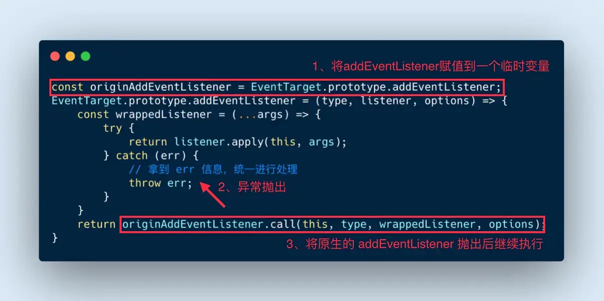
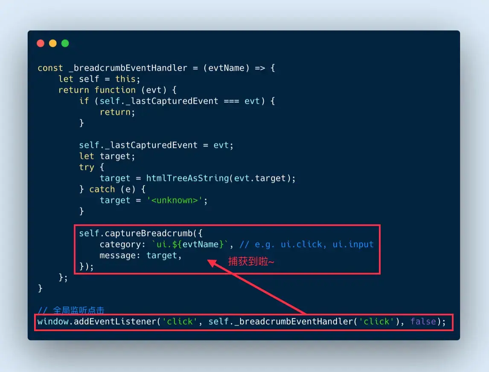
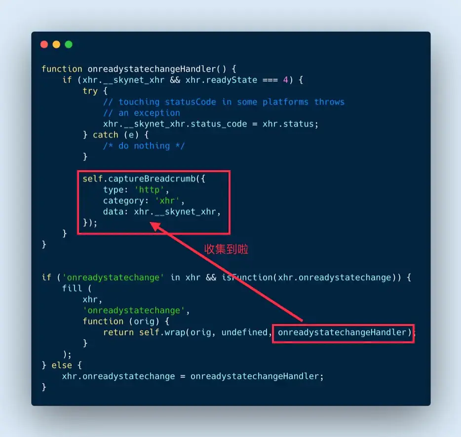
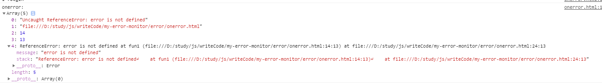

# 异常监控系统

## 异常类型

### js 异常

- **try-catch**

  缺点：无法捕获异步错误

- **window.error**

  可捕获异步，信息全面

  _返回 true 就不会被上抛了。不然控制台中还会看到错误日志。_

  缺点：无法捕获网络请求错误

- **监听 error 事件**

  ```js
  window.addEventListener('error',() => {}）
  ```

- **Promise 错误**

  ```js
  window.addEventListener("unhandledrejection", (e) => {
    throw e.reason;
  });
  ```

- **Async/await 错误**

  本质就是 Promise 监听 unhandledrejection 向上抛出错误即可

- **总结**

  我们可以将 unhandledrejection 事件抛出的异常再次抛出就可以统一通过 error 事件进行处理了。

  ```js
  window.addEventListener("unhandledrejection", (e) => {
    throw e.reason;
  });
  window.addEventListener(
    "error",
    (args) => {
      console.log("error event:", args);
      return true;
    },
    true
  );
  ```



这是 AOP（面向切面编程）设计模式，当错误发生的时候，我们会在 catch 中重新 throw 一个错误出来，最后在将原生 addEventListener 抛出执行。

### Vue

```js
Vue.config.errorHandler = (err, vm, info) => {
  let { message, name, script = "", line = 0, column = 0, stack } = err;
  console.log("errorHandler:", err);
};
```

### React

**错误边界仅可以捕获其子组件的错误**。错误边界无法捕获其自身的错误。如果一个错误边界无法渲染错误信息，则错误会向上冒泡至最接近的错误边界。

使用componentDidCatch 进行错误捕获

```js
import React from "react";
export default class ErrorBoundary extends React.Component {
  constructor(props) {
    super(props);
  }

  componentDidCatch(error, info) {
    // 发生异常时打印错误
    console.log("componentDidCatch", error);
  }

  render() {
    return this.props.children;
  }
}
```

## 环境信息收集

[贝贝方案](https://www.bilibili.com/read/cv7634330?share_medium=android&share_plat=android&share_source=WEIXIN&share_tag=s_i&timestamp=1606999965&unique_k=55W6jo)

### 行为分类

#### 用户行为

使用 **addEventListener** 全局监听点击事件，将用户行为（click、input）和 dom 元素名字收集。当错误发生将**错误**和**行为**一起上报。



#### 浏览器行为

监听 XMLHttpRequest 对象的 onreadystatechange 回调函数，在回调函数执行时收集数据。



监听 **window.onpopstate**，页面跳转的时会触发此方法，将信息收集。

## 错误上报

### img 上报

推荐使用1*1的gif

**原因是：**
1、没有跨域问题
2、发 GET 请求之后不需要获取和处理数据、服务器也不需要发送数据
3、不会携带当前域名 cookie！
4、不会阻塞页面加载，影响用户的体验，只需 **new Image** 对象
5、相比于 BMP/PNG 体积最小，可以节约 41% / 35% 的网络资源小

```js
new Image().src = "http://localhost:7001/monitor/error";
```

### ajax 上报

```js
axios.post("http://localhost:7001/monitor/error");
```

### 上报数据



```js
// 分别是错误信息，错误地址，lineno，colno，error.message,error.stack
```

```js
// 将info信息序列化后上传
const str = window.btoa(JSON.stringify(info));
const host = "http://localhost:7001/monitor/error";
new Image().src = `${host}?info=${str}`;
```

## 数据清洗去重

```js
      except: [
        /^Script error\.?/,
        /^Javascript error: Script error\.? on line 0/,
      ], // 忽略某个错误
     repeat:5
// 重复出现的错误，只上报config.repeat次
    repeat(error) {
      const rowNum = error.rowNum || '';
      const colNum = error.colNum || '';
      const repeatName = error.msg + rowNum + colNum;
      this.repeatList[repeatName] = this.repeatList[repeatName]
        ? this.repeatList[repeatName] + 1
        : 1;
      return this.repeatList[repeatName] > this.config.repeat;
    }

    // 忽略错误
    except(error) {
      const oExcept = this.config.except;
      let result = false;
      let v = null;
      if (utils.typeDecide(oExcept, 'Array')) {
        for (let i = 0, len = oExcept.length; i < len; i++) {
          v = oExcept[i];
          if ((utils.typeDecide(v, 'RegExp') && v.test(error.msg))) {
            result = true;
            break;
          }
        }
      }
      return result;
    }
```

## sourceMap上传

```js
let mapKeys = Object.keys(compilation.assets).filter(item => /.map$/.test(item.toLowerCase()))
let promiseList = []
for (let item in mapKeys) {
    promiseList.push(
        getClient(
            appKeys,
            appVersion,
            mapKeys[item].substr(mapKeys[item].lastIndexOf('/') + 1),
            compilation.assets[mapKeys[item]].source().toString()
        )
    )
}
Promise.all(promiseList)
```

## 插入html

```js
const HtmlWebpackPlugin = require('html-webpack-plugin')
const { type } = require('os')
const { resolve } = require('path')
const { compilation } = require('webpack')
class HtmlAddAttrPlugins {
    constructor(options = {}) {
        this.options = options
    }

    addAttr (tag, key, val) {
        if (!tag || !tag.length) return
        tag.forEach((tag, index) => {
            let value = val
            if (typeof val === 'function') {
                value = val(tag, compilation, index)
            }
            !tag.attributes && (tag.attributes = {})
            tag.attributes[key] = value
        })
    }
    apply (compiler) {
        let _self = this
        compiler.hooks.compilation.tap('htmlPlugin', compilation => {
            HtmlWebpackPlugin.getHooks(compilation).alterAssetTagGroup.tapAysnc('htmlPlugin',
                (data, cb) => {
                    let options = Object.assign({}, null, _self.options.attributes)
                    Object.keys(options).forEach((key) => {
                        let val = options[key]
                        if (typeof value != "string" && typeof value != 'function') return
                        _self.addAttr(data.headTags, key, value)
                        _self.addAttr(data.bodyTags, key, value)
                    })
                    if (typeof cb === 'function') {
                        cb(null, data)
                    } else {
                        return new Promise(resolve => resolve(data))
                    }
                })
        })
    }
}
```


## 异常收集

这里使用 egg 进行异常收集

将错误接收并转码写入到日志中

```js
async index() {
    const { ctx } = this;
    const { info } = ctx.query
    const json = JSON.parse(Buffer.from(info, 'base64').toString('utf-8'))
    console.log('fronterror:', json)
    // 记入错误日志
    this.ctx.getLogger('frontendLogger').error(json)
    ctx.body = '';
  }
```

## **整理与上报方案**

除了异常报错信息本身，我们还需要记录用户操作日志，以实现场景复原。这就涉及到上报的量和频率问题。如果任何日志都立即上报，这无异于自造的DDOS攻击。因此，我们需要合理的上报方案。

### **前端存储日志**

|              |        |              |                |            |        |
| ------------ | ------ | ------------ | -------------- | ---------- | ------ |
| **存储方式** | cookie | localStorage | sessionStorage | IndexedDB  | webSQL |
| **类型**     |        | key-value    | key-value      | NoSQL      | SQL    |
| **数据格式** | string | string       | string         | object     |        |
| **容量**     | 4k     | 5M           | 5M             | 500M       | 60M    |
| **进程**     | 同步   | 同步         | 同步           | 异步       | 异步   |
| **检索**     |        | key          | key            | key, index | field  |
| **性能**     |        | 读快写慢     |                | 读慢写快   |        |

综合之后，IndexedDB是最好的选择，它具有容量大、异步的优势，异步的特性保证它不会对界面的渲染产生阻塞。缺点，就是api非常复杂，不像localStorage那么简单直接。针对这一点，我们可以使用**hello-indexeddb**这个工具

当一个事件、变动、异常被捕获之后，形成一条初始日志，被立即放入暂存区（indexedDB的一个store），之后主程序就结束了收集过程，**后续的事只在webworker中发生**。在一个webworker中，一个循环任务不断从暂存区中取出日志，对日志进行分类，将分类结果存储到索引区中，并对日志记录的信息进行丰富，将最终将会上报到服务端的日志记录转存到归档区

## 日志分析

日志分析的关键在于 webpack 打包时将打包完成的 sourceMap 进行上传

### webpack Plugins

```js
apply(compiler) {
    console.log('UploadSourceMapWebPackPlugin apply')
    // 定义在打包后执行
    compiler.hooks.done.tap('upload-sourecemap-plugin', async status => {
        // 读取sourcemap文件
        const list = glob.sync(path.join(status.compilation.outputOptions.path, `./**/*.{js.map,}`))
        // console.log('list:', list)
        for (let filename of list) {
            await this.upload(this.options.uploadUrl, filename)
        }
    })
}
```

### 服务端接收并保存

```js
async upload() {
    const { ctx } = this
    const stream = ctx.req
    const filename = ctx.query.name
    const dir = path.join(this.config.baseDir, 'uploads')
    // 判断upload目录是否存在
    if (!fs.existsSync(dir)) {
      fs.mkdirSync(dir)
    }

    const target = path.join(dir, filename)
    const writeStream = fs.createWriteStream(target)
    stream.pipe(writeStream)
}
```

### 反序列化 Error

使用 error-stack-parser 将上传的


## 信息上报

### 用户体验层

 window.performance.timing

```js
timing: {
        // 同一个浏览器上一个页面卸载(unload)结束时的时间戳。如果没有上一个页面，这个值会和fetchStart相同。
	navigationStart: 1543806782096,

	// 上一个页面unload事件抛出时的时间戳。如果没有上一个页面，这个值会返回0。
	unloadEventStart: 1543806782523,

	// 和 unloadEventStart 相对应，unload事件处理完成时的时间戳。如果没有上一个页面,这个值会返回0。
	unloadEventEnd: 1543806782523,

	// 第一个HTTP重定向开始时的时间戳。如果没有重定向，或者重定向中的一个不同源，这个值会返回0。
	redirectStart: 0,

	// 最后一个HTTP重定向完成时（也就是说是HTTP响应的最后一个比特直接被收到的时间）的时间戳。
	// 如果没有重定向，或者重定向中的一个不同源，这个值会返回0. 
	redirectEnd: 0,

	// 浏览器准备好使用HTTP请求来获取(fetch)文档的时间戳。这个时间点会在检查任何应用缓存之前。
	fetchStart: 1543806782096,

	// DNS 域名查询开始的UNIX时间戳。
        //如果使用了持续连接(persistent connection)，或者这个信息存储到了缓存或者本地资源上，这个值将和fetchStart一致。
	domainLookupStart: 1543806782096,

	// DNS 域名查询完成的时间.
	//如果使用了本地缓存（即无 DNS 查询）或持久连接，则与 fetchStart 值相等
	domainLookupEnd: 1543806782096,

	// HTTP（TCP） 域名查询结束的时间戳。
        //如果使用了持续连接(persistent connection)，或者这个信息存储到了缓存或者本地资源上，这个值将和 fetchStart一致。
	connectStart: 1543806782099,

	// HTTP（TCP） 返回浏览器与服务器之间的连接建立时的时间戳。
        // 如果建立的是持久连接，则返回值等同于fetchStart属性的值。连接建立指的是所有握手和认证过程全部结束。
	connectEnd: 1543806782227,

	// HTTPS 返回浏览器与服务器开始安全链接的握手时的时间戳。如果当前网页不要求安全连接，则返回0。
	secureConnectionStart: 1543806782162,

	// 返回浏览器向服务器发出HTTP请求时（或开始读取本地缓存时）的时间戳。
	requestStart: 1543806782241,

	// 返回浏览器从服务器收到（或从本地缓存读取）第一个字节时的时间戳。
        //如果传输层在开始请求之后失败并且连接被重开，该属性将会被数制成新的请求的相对应的发起时间。
	responseStart: 1543806782516,

	// 返回浏览器从服务器收到（或从本地缓存读取，或从本地资源读取）最后一个字节时
        //（如果在此之前HTTP连接已经关闭，则返回关闭时）的时间戳。
	responseEnd: 1543806782537,

	// 当前网页DOM结构开始解析时（即Document.readyState属性变为“loading”、相应的 readystatechange事件触发时）的时间戳。
	domLoading: 1543806782573,

	// 当前网页DOM结构结束解析、开始加载内嵌资源时（即Document.readyState属性变为“interactive”、相应的readystatechange事件触发时）的时间戳。
	domInteractive: 1543806783203,

	// 当解析器发送DOMContentLoaded 事件，即所有需要被执行的脚本已经被解析时的时间戳。
	domContentLoadedEventStart: 1543806783203,

	// 当所有需要立即执行的脚本已经被执行（不论执行顺序）时的时间戳。
	domContentLoadedEventEnd: 1543806783216,

	// 当前文档解析完成，即Document.readyState 变为 'complete'且相对应的readystatechange 被触发时的时间戳
	domComplete: 1543806783796,

	// load事件被发送时的时间戳。如果这个事件还未被发送，它的值将会是0。
	loadEventStart: 1543806783796,

	// 当load事件结束，即加载事件完成时的时间戳。如果这个事件还未被发送，或者尚未完成，它的值将会是0.
	loadEventEnd: 1543806783802
}
```

通过以上数据，我们可以得到几个有用的时间

```js
DNS 查询耗时 ：domainLookupEnd - domainLookupStart
TCP 链接耗时 ：connectEnd - connectStart
request 请求耗时 ：responseEnd - responseStart
解析 dom 树耗时 ： domComplete - domInteractive
白屏时间 ：responseStart - navigationStart
domready 时间 ：domContentLoadedEventEnd - navigationStart
onload 时间 ：loadEventEnd – navigationStart
```

### 业务层

- PV(Page View)：页面浏览量或点击量
- UV()：指访问某个站点的不同ip地址的人数
- 页面停留时间：用户在每一个页面的停留时间


## 小程序错误上报

**差异化劫持，格式化上报**

劫持APP方法

```js
  // 劫持原小程序App方法
  rewriteApp() {
    const originApp = App;

    const self = this;
    App = function (app) {
      // 合并方法，插入记录脚本
      ['onLaunch', 'onShow', 'onHide', 'onError'].forEach((methodName) => {
        const userDefinedMethod = app[methodName]; // 暂存用户定义的方法
        if (methodName === 'onLaunch') {
          self.getNetworkType();
          self.config.setLocation && self.getLocation();
          self.config.setSystemInfo && self.getSystemInfo();
        }
        app[methodName] = function (options) {
          methodName === 'onError' && self.error({ msg: options }); // 错误上报
          return userDefinedMethod && userDefinedMethod.call(this, options);
        };
      });
      return originApp(app);
    };
  }
```

劫持Page方法

```js
  // 劫持原小程序Page方法
 function rewritePage() {
    const originPage = Page;
    Page = (page) => {
      Object.keys(page).forEach((methodName) => {
        typeof page[methodName] === 'function'
          && this.recordPageFn(page, methodName);
      });
      // 强制记录两生命周期函数
      page.onReady || this.recordPageFn(page, 'onReady'); // 这个函数记录错误的时间，所在页面，方法名等信息
      page.onLoad || this.recordPageFn(page, 'onLoad');
      // 执行原Page对象
      return originPage(page);
    };
  }
```

### 环境信息获取

```js
//app.js
globalData:{
    referrer:{}
}
onShow(options){
    this.globalData.referrer=options
}

// SDK.js
let App= getApp()
let refererObj= App.globalData.referrer
```


## 参考文章

[使用vue+node搭建前端异常监控系统](https://mp.weixin.qq.com/s?__biz=MzAwMDY2OTU3NQ==&mid=2247483938&idx=1&sn=071276a967d289cd6fc52599da7099fc&chksm=9ae420caad93a9dc3338077c4ebec113ce3815b107182792312d39d3dd58a6da42f86f2d94e7&mpshare=1&scene=1&srcid=1012eLPZMNk9ggaxTGm2Ofgi&sharer_sharetime=1602485080984&sharer_shareid=12302458a55e6884c1bb1c47ff44880d&key=e916915e2e1878497a86d937dde233c512320fc8e640b974e1f6c8c394c152aad3a254e5a4afe776e24633c05a376f0859850be412fb70d735aee1c4f2c332918e39756025b36355e5ce41ffc21e4190f8b32f8a56f9edc97078f44646c9e857c3fba9fdf680b5e4f92e9cffd766a34a0f91a8b579ea96b3beaddc2db079c7e5&ascene=1&uin=MTIwOTc2NTAyMQ%3D%3D&devicetype=Windows+10+x64&version=6300002f&lang=zh_CN&exportkey=AbhxOcEv5LRRnJfJpOYk54M%3D&pass_ticket=RBJLbuhFUaC7C9iLpQ3G0QWDO%2FARo9ozdYLpRAv%2BPLVGoUhb9Vsl%2FpuWtmjHagMs&wx_header=0)

[深入理解前端性能监控](https://mp.weixin.qq.com/s?__biz=MzUzNjk5MTE1OQ==&mid=2247487964&idx=1&sn=bd50e0b48efc9a26c733e76c4159762c&chksm=faec9504cd9b1c1222b63267a27939c567cd0306a1db227eb77132be1d467be008d344cf1d04&mpshare=1&scene=1&srcid=0913rGwXFrCN0r0Sw4dlB9eI&sharer_sharetime=1600002595509&sharer_shareid=12302458a55e6884c1bb1c47ff44880d&key=2feebe5847c6e0bc331f0531a0062a22c6a77e1714978022748867c3e6f7fdf3572cc4b0f1cefc7209b4ee272f0b306f520eb065c223c2e0a75e06144b45c94decfae44e4e2efd1cef22401d277069cf0f643807b04cb9e6840b48abcb43e9235449e0abc1e91d9bdfcf71c6f95545a19135a8486191820fde8c7da86053ae2b&ascene=1&uin=MTIwOTc2NTAyMQ%3D%3D&devicetype=Windows+10+x64&version=6300002f&lang=zh_CN&exportkey=AYK1gS0QZbiyqzYZK1AxjSY%3D&pass_ticket=RBJLbuhFUaC7C9iLpQ3G0QWDO%2FARo9ozdYLpRAv%2BPLVGoUhb9Vsl%2FpuWtmjHagMs&wx_header=0)

[一文从零彻底搞懂前端的内存监控、异常、泄漏](https://mp.weixin.qq.com/s?__biz=MzI2NTk2NzUxNg==&mid=2247488384&idx=1&sn=986fa865425162a9ac23259dec41671d&chksm=ea941173dde398654a1840c5abf482e71f69274c70d27bc5aff71caf7b6c04c9984e1fa3e35a&mpshare=1&scene=1&srcid=0911J18opV3TGVyDfVt5Avkw&sharer_sharetime=1599787444615&sharer_shareid=12302458a55e6884c1bb1c47ff44880d&key=c30e52a6f1284ff4350756ad970a6facd60382717dc26f8beb7f9138b3b55be70dbdd831275f3370037525d45d6bf4b9900c7a7e126901013bb62caba32afbb5bd5b86da5997434ea34cc766ac627b280f23b48f703657f0240834d11d0b3cd13c342aa454412dea2853e0ae4059c0a44ceb3d0367d53d5b59229916b7c47b0d&ascene=1&uin=MTIwOTc2NTAyMQ%3D%3D&devicetype=Windows+10+x64&version=6300002f&lang=zh_CN&exportkey=Af4iBS%2BDgcgsY5FmtNTv1rU%3D&pass_ticket=RBJLbuhFUaC7C9iLpQ3G0QWDO%2FARo9ozdYLpRAv%2BPLVGoUhb9Vsl%2FpuWtmjHagMs&wx_header=0)

[完善的前端异常监控解决方案](https://mp.weixin.qq.com/s?__biz=MzA3MjkwNTM1Mw==&mid=2649140436&idx=1&sn=ee16143bca46329e97f825e4e8018b03&chksm=87052b32b072a224c6748fdee887fed2e674eb8a9e8e56032a5819671bf1b695bda853e5a572&mpshare=1&scene=1&srcid=0819yumnayDisywshbEeNjsy&sharer_sharetime=1597848188765&sharer_shareid=12302458a55e6884c1bb1c47ff44880d&key=e916915e2e187849eea0cdd2d2945d6d3bd32745cf323c23d708dbbfda954aa0ba6305fc22ff9311e7fad83862288bf9aa991c7b3d0c1c5df0605562458b3b4ed28b794fdafa49043d52041a8ed4bade98c6eabe9ffa31369e2e902e7f87ced69a92df3e0fb76c650fb6fbf02e73ad1600f794af1976d463655b7d6b399f38ea&ascene=1&uin=MTIwOTc2NTAyMQ%3D%3D&devicetype=Windows+10+x64&version=6300002f&lang=zh_CN&exportkey=AUHT36tpKw4Y18ZV90c0kEk%3D&pass_ticket=RBJLbuhFUaC7C9iLpQ3G0QWDO%2FARo9ozdYLpRAv%2BPLVGoUhb9Vsl%2FpuWtmjHagMs&wx_header=0)

[搭建前端监控平台之数据上报](https://mp.weixin.qq.com/s?__biz=Mzg5NDAyNjc2MQ==&mid=2247485425&idx=1&sn=c6b9cf30bc5748e5ecfea40d63949499&chksm=c0249297f7531b8196f40c0f2908cc87ff634e0f96d62cbf35ca46d6339c2ed4424ddf111e9e&mpshare=1&scene=1&srcid=1110oDOswZMOEFXzypr3tBUI&sharer_sharetime=1604981995699&sharer_shareid=12302458a55e6884c1bb1c47ff44880d&key=2feebe5847c6e0bc7b1dac79d29ea0e15a1a01f7ba190cd7eae1aa71d893790bd3d1e5299374971282fc0f5574d3e1687084eeb9129ff7b798f0595fc45d84d0def007c84690c5dce423a2c64755d6d39d17e453f7c8e003e59a53a9d14ce4ac24219b06782354121fdebe48c66b20e8195a48c44aea4d87ab3bbf7e51a7a4b4&ascene=1&uin=MTIwOTc2NTAyMQ%3D%3D&devicetype=Windows+10+x64&version=6300002f&lang=zh_CN&exportkey=ARrT%2FYtgK3GYB%2FsKP1kiQ1k%3D&pass_ticket=RBJLbuhFUaC7C9iLpQ3G0QWDO%2FARo9ozdYLpRAv%2BPLVGoUhb9Vsl%2FpuWtmjHagMs&wx_header=0)