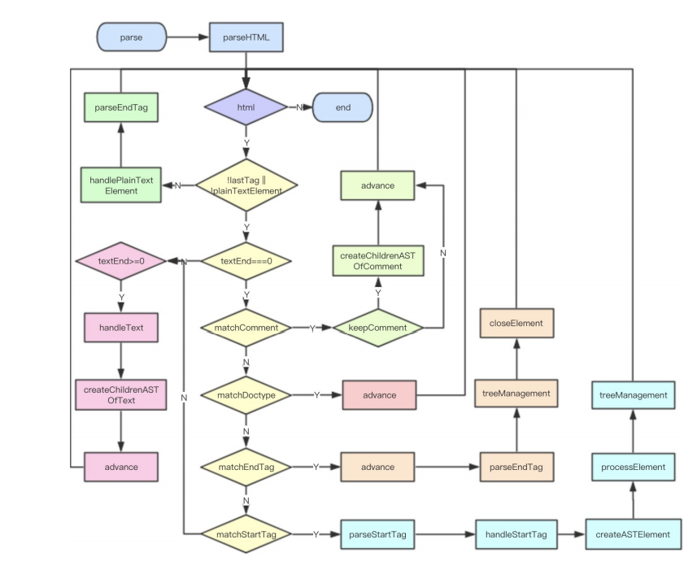

# Vue2 源码阅读

## 准备工作

vue中使用的类型检查工具是 Flow.js 有点类似TypeScript 。

### 目录

```js
src
├── compiler # 编译相关 包括把模板解析成 ast 语法树，ast 语法树优化，代码⽣成等功能。
├── core # 核⼼代码  包括内置组件、全局 API 封装，Vue 实例化、观察者、虚拟 DOM、⼯具函数等等。
├── platforms # 不同平台的⽀持 web和 weex入口，
├── server # 服务端渲染
├── sfc # .vue ⽂件解析
├── shared # 共享代码
```

### 选择版本

- Runtime Only

  我们在使用 Runtime Only 版本的 Vue.js 的时候，通常需要借助如 webpack 的 vue-loader ⼯具把 .vue ⽂ 件编译成 JavaScript，因为是在编译阶段做的，所以它只包含运行时的 Vue.js 代码，因此代码体积也会 更轻量。

- Runtime+Compiler

```js
// 需要编译器的版本
new Vue({
template: '<div>{{ hi }}</div>'
})

```

## 从入口开始

初始化全局api

```js
initGlobalAPI(Vue)

//
export function initGlobalAPI (Vue: GlobalAPI) {
    Vue.util = { warn, extend, mergeOptions, defineReactive, };
    Vue.set = set;
    Vue.delete = del;
    Vue.nextTick = nextTick; // TODO：nnextTick

    Vue.options = Object.create(null);
    ASSET_TYPES.forEach((type) => {
        Vue.options[type + "s"] = Object.create(null);
    });

    Vue.options._base = Vue;

    extend(Vue.options.components, builtInComponents);

    initUse(Vue); // TODO：initUse
    initMixin(Vue); // TODO：initMixin
    initExtend(Vue);
    initAssetRegisters(Vue); // 注册实现Vue.component/directive/filter
}

```

传入的Vue 将生命周期等混入

```js
//src\core\instance\index.js
function Vue (options) {
    if (process.env.NODE_ENV !== 'production' &&
        !(this instanceof Vue)
    ) {
        warn('Vue is a constructor and should be called with the `new` keyword')
    }
    this._init(options)
}

initMixin(Vue)
stateMixin(Vue)
eventsMixin(Vue)
lifecycleMixin(Vue)
renderMixin(Vue) 

export default Vue
```

**所以Vue本质上就是⼀个用 Function 实现的 Class，然后它的原型 prototype 以及它本⾝都扩展了⼀系列的 方法和属性，**

### init

```js
// src/core/instance/init.js
export function initMixin (Vue: Class<Component>) {
  Vue.prototype._init = function (options?: Object) {
    const vm: Component = this
    // a uid
    vm._uid = uid++
    if (options && options._isComponent) {
      initInternalComponent(vm, options)
    } else {
      vm.$options = mergeOptions(
        resolveConstructorOptions(vm.constructor),
        options || {},
        vm
      )
    }
    // expose real self
    vm._self = vm
    initLifecycle(vm) // $parent,$root,$children,$refs
    initEvents(vm) // 处理父组件传递的事件和回调
    initRender(vm) // $slots,$scopedSlots,_c,$createElement
    callHook(vm, 'beforeCreate')
    initInjections(vm) // 获取注入数据
    initState(vm) // 初始化props，methods，data，computed，watch
    initProvide(vm) // 提供数据注入
    callHook(vm, 'created')

    if (vm.$options.el) {
      vm.$mount(vm.$options.el)
    }
  }
```

Vue 初始化主要就干了几件事情，合并配置，初始化生命周期，初始化事件中心，初始化渲染，初始 化 data、props、computed、watcher 等等。

### $mount

```js
const mount = Vue.prototype.$mount
Vue.prototype.$mount = function (
  el?: string | Element,
  hydrating?: boolean
): Component {
  el = el && query(el)

  /* istanbul ignore if */
  if (el === document.body || el === document.documentElement) {
    process.env.NODE_ENV !== 'production' && warn(
      `Do not mount Vue to <html> or <body> - mount to normal elements instead.`
    )
    return this
  }

  const options = this.$options
  // resolve template/el and convert to render function
  if (!options.render) {
    let template = options.template
    if (template) {
      if (typeof template === 'string') {
        if (template.charAt(0) === '#') {
          template = idToTemplate(template)
          }
        }
      } else if (template.nodeType) {
        template = template.innerHTML
      } else {
        return this
      }
    } else if (el) {
      template = getOuterHTML(el)
    }
    if (template) {
      options.render = render
      options.staticRenderFns = staticRenderFns

    }
  }
  return mount.call(this, el, hydrating)
}
```

⾸先，它 对 el 做了限制，Vue 不能挂载在 body 、 html 这样的根节点上。

接下来的是很关键的逻辑 —— 如果没有定义 render 方法，则会把 el 或者 template 字符串**转换成 render 方法**。

#### mountComponent

```js
// src/core/instance/lifecycle.js 
export function mountComponent (
  vm: Component,
  el: ?Element,
  hydrating?: boolean
): Component {
  vm.$el = el
  callHook(vm, 'beforeMount')

  let updateComponent
  /* istanbul ignore if */
  if (process.env.NODE_ENV !== 'production' && config.performance && mark) {
    updateComponent = () => {
      const name = vm._name
      const id = vm._uid
      const startTag = `vue-perf-start:${id}`
      const endTag = `vue-perf-end:${id}`

      mark(startTag)
      const vnode = vm._render()
      mark(endTag)
      measure(`vue ${name} render`, startTag, endTag)

      mark(startTag)
      vm._update(vnode, hydrating)
      mark(endTag)
      measure(`vue ${name} patch`, startTag, endTag)
    }
  } else {
    updateComponent = () => {
      vm._update(vm._render(), hydrating)
    }
  }
  new Watcher(vm, updateComponent, noop, {
    before () {
      if (vm._isMounted && !vm._isDestroyed) {
        callHook(vm, 'beforeUpdate')
      }
    }
  }, true /* isRenderWatcher */)
  hydrating = false

  if (vm.$vnode == null) {
    vm._isMounted = true
    callHook(vm, 'mounted')
  }
  return vm
}
```

从上⾯的代码可以看到， mountComponent 核⼼就是先调用 vm._render 方法先⽣成虚拟 Node，再实例化⼀个渲染 Watcher ，在它的回调函数中会调用 updateComponent 方法，最终调用 vm._update 更新 DOM。 

Watcher 在这里起到两个作用，⼀个是初始化的时候会执行回调函数，另⼀个是当 vm 实例中的监测 的数据发⽣变化的时候执行回调函数。

函数最后判断为根节点的时候设置 vm._isMounted 为 true ， 表示这个实例已经挂载了，同时执行 mounted 钩子函数。 这里注意 vm.$vnode 表示 Vue 实例的父虚拟 Node，所以它为 Null 则表示 当前是根 Vue 的实例。


#### render

Vue 的 _render 方法是实例的⼀个私有方法，它用来把实例渲染成⼀个虚拟 Node。

```js
<div id="app">
{{ message }}
</div>
```

转化成

```js
render: function (createElement) {
    return createElement('div', {
        attrs: {
            id: 'app'
        },
    }, this.message)
}
```

#### Virtual DOM

Virtual DOM 就是用⼀个原⽣的 JS 对象去描述⼀个 DOM 节点，所以它比创建⼀个 DOM 的代价要 ⼩很多。

```js
export default class VNode {
  tag: string | void; // 标签
  data: VNodeData | void; // 数据
  children: ?Array<VNode>; // 子节点
  text: string | void; // 文本
  elm: Node | void;
  ns: string | void;
  context: Component | void; // rendered in this component's scope
  key: string | number | void;
  componentOptions: VNodeComponentOptions | void;
  componentInstance: Component | void; // component instance
  parent: VNode | void; // component placeholder node

  // strictly internal
  raw: boolean; // 包含原始HTML？(仅限服务器)。
  isStatic: boolean; // 是静态节点吗
  isRootInsert: boolean; // 进入Root必须吗
  isComment: boolean; // 空注释占位符?
  isCloned: boolean; // 是克隆节点吗?
  isOnce: boolean; // 是v-once节点吗?
  asyncFactory: Function | void; // 异步组件工厂函数。
  asyncMeta: Object | void;
  isAsyncPlaceholder: boolean;
  ssrContext: Object | void;
  fnContext: Component | void; // 功能节点的真实上下文虚拟机
  fnOptions: ?ComponentOptions; // for SSR caching
  devtoolsMeta: ?Object; // 用于存储DevTools的功能渲染上下文
  fnScopeId: ?string; // functional scope id support

  constructor (
    tag?: string,
    data?: VNodeData,
    children?: ?Array<VNode>,
    text?: string,
    elm?: Node,
    context?: Component,
    componentOptions?: VNodeComponentOptions,
    asyncFactory?: Function
  ) {

  }

  // DEPRECATED: alias for componentInstance for backwards compat.
  /* istanbul ignore next */
  get child (): Component | void {
    return this.componentInstance
  }
}
```

其实 VNode 是对真实 DOM 的⼀种抽象描述，它的核心定义无非就几个关键属性，**标签名、数据、子节点、键值等**，其它属性都是都是用来扩展 VNode 的灵活性以及实现⼀些特殊 feature 的。由于 VNode 只是用来映射到真实 DOM 的渲染，不需要包含操作 DOM 的方法，因此它是非常轻量和简单的。

#### update

Vue 的 _update 是实例的⼀个私有方法，**它被调用的时机有 2 个，⼀个是首次渲染，⼀个是数据更新的时候；**

```js
//src/core/instance/lifecycle.js 
Vue.prototype._update = function (vnode: VNode, hydrating?: boolean) {
    const vm: Component = this
    const prevEl = vm.$el
    const prevVnode = vm._vnode
    const restoreActiveInstance = setActiveInstance(vm)
    vm._vnode = vnode
    // Vue.prototype.__patch__ is injected in entry points
    // based on the rendering backend used.
    if (!prevVnode) {
      // initial render
      vm.$el = vm.__patch__(vm.$el, vnode, hydrating, false /* removeOnly */)
    } else {
      // updates
      vm.$el = vm.__patch__(prevVnode, vnode)
    }
    restoreActiveInstance()
    // update __vue__ reference
    if (prevEl) {
      prevEl.__vue__ = null
    }
    if (vm.$el) {
      vm.$el.__vue__ = vm
    }
    // if parent is an HOC, update its $el as well
    if (vm.$vnode && vm.$parent && vm.$vnode === vm.$parent._vnode) {
      vm.$parent.$el = vm.$el
    }
    // updated hook is called by the scheduler to ensure that children are
    // updated in a parent's updated hook.
  }
```

这里逻辑不用看，下面会详细说，我们知道最后会进入`__patch__` 即可

核心方法`__patch__`  区分服务端渲染

```js
// src/platforms/web/runtime/index.js 
Vue.prototype.__patch__ = inBrowser ? patch : noop
// src\platforms\web\runtime\patch.js
//每个平台都有各⾃的 nodeOps 和 modules
export const patch: Function = createPatchFunction({ nodeOps, modules })
```

VDom 进行diff 的地方 ，后面再来分析

// TODO:diff

```js
// src/core/vdom/patch.js

```


### 总结

- 首先new Vue() 
- => init() 进行全局属性和生命周期等注入 
  - beforeMount
- => 将$mount 挂载 
- => `_render` 函数将temlate转化成Vdom 
- =>  `_patch`将Vdom转化成真实DOM
  - 初次渲染，不用diff
  - Dom变化，diff算法后 异步更新
- 渲染完成，等待更新
  - Mounted

## 组件化

### **createElement**

createElement 有三个分支逻辑

1. 假如是普通的html标签，渲染一个VNode
2. 假如是componen且options中注册了 ，就进入createComponent 逻辑
3. 不命名tag，也创建一个VNode

```js
//src\core\vdom\create-element.js  function _createElement
if (typeof tag === 'string') {
    let Ctor
    ns = (context.$vnode && context.$vnode.ns) || config.getTagNamespace(tag)
    if (config.isReservedTag(tag)) {
      // platform built-in elements
      vnode = new VNode(
        config.parsePlatformTagName(tag), data, children,
        undefined, undefined, context
      )
    } else if ((!data || !data.pre) && isDef(Ctor = resolveAsset(context.$options, 'components', tag))) {
      // component
      vnode = createComponent(Ctor, data, context, children, tag)
    } else {
      // unknown or unlisted namespaced elements
      // check at runtime because it may get assigned a namespace when its
      // parent normalizes children
      vnode = new VNode(
        tag, data, children,
        undefined, undefined, context
      )
    }
  } else {
    // 组件的构造函数
    vnode = createComponent(tag, data, context, children)
  }
```

### createComponent

```js
export function createComponent (
  Ctor: Class<Component> | Function | Object | void,
  data: ?VNodeData,
  context: Component,
  children: ?Array<VNode>,
  tag?: string
): VNode | Array<VNode> | void {
    
  // plain options object: turn it into a constructor
  if (isObject(Ctor)) {
    Ctor = baseCtor.extend(Ctor)
  }
  // async component
  let asyncFactory
  if (isUndef(Ctor.cid)) {
    asyncFactory = Ctor
    Ctor = resolveAsyncComponent(asyncFactory, baseCtor)
    if (Ctor === undefined) {
      // return a placeholder node for async component, which is rendered
      // as a comment node but preserves all the raw information for the node.
      // the information will be used for async server-rendering and hydration.
      return createAsyncPlaceholder(
        asyncFactory,
        data,
        context,
        children,
        tag
      )
    }
  }

  data = data || {}

  // resolve constructor options in case global mixins are applied after
  // component constructor creation
  resolveConstructorOptions(Ctor)

  // transform component v-model data into props & events
  if (isDef(data.model)) {
    transformModel(Ctor.options, data)
  }

  // extract props
  const propsData = extractPropsFromVNodeData(data, Ctor, tag)

  // functional component
  if (isTrue(Ctor.options.functional)) {
    return createFunctionalComponent(Ctor, propsData, data, context, children)
  }


  const listeners = data.on
  data.on = data.nativeOn

  if (isTrue(Ctor.options.abstract)) {
    // abstract components do not keep anything
    // other than props & listeners & slot

    // work around flow
    const slot = data.slot
    data = {}
    if (slot) {
      data.slot = slot
    }
  }

  // install component management hooks onto the placeholder node
  installComponentHooks(data)

  // return a placeholder vnode
  const name = Ctor.options.name || tag
  const vnode = new VNode(
    `vue-component-${Ctor.cid}${name ? `-${name}` : ''}`,
    data, undefined, undefined, undefined, context,
    { Ctor, propsData, listeners, tag, children },
    asyncFactory
  )
  return vnode
}
```

去掉多余的判断，可以整理出他做了三件事

#### 构造子类构造函数

```js
export default {
    name: 'app',
    components: {
        HelloWorld
    }
}
// 我们平时传入的都是一个对象
  if (isObject(Ctor)) {
    Ctor = baseCtor.extend(Ctor)
  }
//src/core/global-api/extend.js 

```

Vue.extend 的作用就是构造⼀个 Vue 的子类，它使用⼀种非常经典的原型继承的方式把⼀个纯对 象转换⼀个继承于 Vue 的构造器 Sub 并返回，然后对 Sub 这个对象本⾝扩展了⼀些属性，如扩 展 options 、添加全局 API 等；并且对配置中的 props 和 computed 做了初始化⼯作；最后对于 这个 Sub 构造函数做了缓存，避免多次执行 Vue.extend 的时候对同⼀个子组件重复构造。

```js
Vue.extend = function (extendOptions: Object): Function {
    extendOptions = extendOptions || {}
    const Super = this
    const SuperId = Super.cid
    const cachedCtors = extendOptions._Ctor || (extendOptions._Ctor = {})
    if (cachedCtors[SuperId]) {
      return cachedCtors[SuperId]
    }

    const name = extendOptions.name || Super.options.name
    if (process.env.NODE_ENV !== 'production' && name) {
      validateComponentName(name)
    }

    const Sub = function VueComponent (options) {
      this._init(options)
    }
    Sub.prototype = Object.create(Super.prototype)
    Sub.prototype.constructor = Sub
    Sub.cid = cid++
    Sub.options = mergeOptions(
      Super.options,
      extendOptions
    )
    Sub['super'] = Super

    // For props and computed properties, we define the proxy getters on
    // the Vue instances at extension time, on the extended prototype. This
    // avoids Object.defineProperty calls for each instance created.
    if (Sub.options.props) {
      initProps(Sub)
    }
    if (Sub.options.computed) {
      initComputed(Sub)
    }

    // allow further extension/mixin/plugin usage
    Sub.extend = Super.extend
    Sub.mixin = Super.mixin
    Sub.use = Super.use

    // create asset registers, so extended classes
    // can have their private assets too.
    ASSET_TYPES.forEach(function (type) {
      Sub[type] = Super[type]
    })
    // enable recursive self-lookup
    if (name) {
      Sub.options.components[name] = Sub
    }

    // keep a reference to the super options at extension time.
    // later at instantiation we can check if Super's options have
    // been updated.
    Sub.superOptions = Super.options
    Sub.extendOptions = extendOptions
    Sub.sealedOptions = extend({}, Sub.options)

    // cache constructor
    cachedCtors[SuperId] = Sub
    return Sub
  }
```


#### 安装组件钩子函数

整个 **installComponentHooks** 的过程就是把 componentVNodeHooks 的钩子函数合并到 **data.hook** 中，在 VNode 执行 patch 的过程中执行相关的钩子函数,但他的Marge不是覆盖，而是按顺序执行。

#### 实例化VNode

最后⼀步非常简单，通过 new VNode 实例化⼀个 vnode 并返回。需要注意的是和普通元素节点的 vnode 不同，组件的 vnode 是没有 children 的，这点很关键。

### patch

**执行 vm.patch 去把 VNode 转换成真正的 DOM 节点。**

```js
//src/core/vdom/patch.js 
function createElm (
    vnode,
    insertedVnodeQueue,
    parentElm,
    refElm,
    nested,
    ownerArray,
    index
) {
    // ...
    if (createComponent(vnode, insertedVnodeQueue, parentElm, refElm)) {
        return
    }
    // ...
  }
```

#### createComponent

```js
	function createComponent (vnode, insertedVnodeQueue, parentElm, refElm) {
		let i = vnode.data
		if (isDef(i)) {
			const isReactivated = isDef(vnode.componentInstance) && i.keepAlive
			if (isDef(i = i.hook) && isDef(i = i.init)) {
				i(vnode, false /* hydrating */)
			}
			//调用init钩子后，如果vnode为子组件。
            //它应该已经创建子实例并挂载它。这孩子。
            //组件还设置了占位符vnode的elm。
            //在这种情况下，我们只需返回元素即可完成。
			if (isDef(vnode.componentInstance)) {
				//属性回调执行
				initComponent(vnode, insertedVnodeQueue)
				//追加到父组件
				insert(parentElm, vnode.elm, refElm)
				if (isTrue(isReactivated)) {
					reactivateComponent(vnode, insertedVnodeQueue, parentElm, refElm)
				}
				return true
			}
		}
	}
```

如果 vnode 是⼀个组件 VNode，那么条件会满⾜，并且得到 i 就是 init 钩子函数，执行`_init`

子组件的实例化实际上就是在这个时机执行的，并且它会执行实例的 _init 方法，

#### _render()

然后进行_render()

```js
// src/core/instance/render.js
  Vue.prototype._render = function (): VNode {
    const vm: Component = this
    const { render, _parentVnode } = vm.$options

    if (_parentVnode) {
      vm.$scopedSlots = normalizeScopedSlots(
        _parentVnode.data.scopedSlots,
        vm.$slots,
        vm.$scopedSlots
      )
    }
    vm.$vnode = _parentVnode
    // render self
    let vnode
    try {
      currentRenderingInstance = vm
      vnode = render.call(vm._renderProxy, vm.$createElement)
    } 
    // 如果返回的数组只包含一个节点，则允许它
    if (Array.isArray(vnode) && vnode.length === 1) {
      vnode = vnode[0]
    }

      vnode = createEmptyVNode()
    }
    // set parent
    vnode.parent = _parentVnode
    return vnode
  }
```

我们只保留关键部分的代码，这里的 _parentVnode 就是当前组件的父 VNode，⽽ render 函数⽣ 成的 vnode 当前组件的渲染 vnode ， vnode 的 parent 指向了 _parentVnode ，也就是 vm.$vnode ，它们是⼀种父子的关系。

#### _update

```js
//src/core/instance/lifecycle.js 
Vue.prototype._update = function (vnode: VNode, hydrating?: boolean) {
    const vm: Component = this
    const prevEl = vm.$el
    const prevVnode = vm._vnode
    //是保持当前上下⽂的 Vue 实例，它是在 lifecycle 模块的全局变量
    const restoreActiveInstance = setActiveInstance(vm)
    vm._vnode = vnode
    // Vue.prototype.__patch__ is injected in entry points
    // based on the rendering backend used.
    if (!prevVnode) {
      // initial render
      vm.$el = vm.__patch__(vm.$el, vnode, hydrating, false /* removeOnly */)
    } else {
      // updates
      vm.$el = vm.__patch__(prevVnode, vnode)
    }
    restoreActiveInstance()
    // update __vue__ reference
    if (prevEl) {
      prevEl.__vue__ = null
    }
    if (vm.$el) {
      vm.$el.__vue__ = vm
    }
    // if parent is an HOC, update its $el as well
    if (vm.$vnode && vm.$parent && vm.$vnode === vm.$parent._vnode) {
      vm.$parent.$el = vm.$el
    }
    // updated hook is called by the scheduler to ensure that children are
    // updated in a parent's updated hook.
  }
```

这里要理清，vm._vnode 和 vm.$vnode 的关系就是⼀种父子关系，用代码表示就是   **vm.`vnode.parent `=== vm.$vnode**

restoreActiveInstance是用来保持递归过程中记录当前vm的parent，当⼀个 vm 实例完成它的所有子树的 patch 或者 update 过程后，

restoreActiveInstance回到他的父实例后，传入的Vue实例和vm.$parent 依然能保留

#### `__patch_`

```js
vm.$el = vm.__patch__(vm.$el, vnode, hydrating, false /* removeOnly */)

function patch (oldVnode, vnode, hydrating, removeOnly) {
    // ...
    let isInitialPatch = false
    const insertedVnodeQueue = []
    // 首次渲染
    if (isUndef(oldVnode)) {
        // empty mount (likely as component), create new root element
        isInitialPatch = true
        createElm(vnode, insertedVnodeQueue)
    } else {
        // ...
    }
    // ...
}
```

##### createElm

```js
	function createElm (
		vnode,
		insertedVnodeQueue,
		parentElm,
		refElm,
		nested,
		ownerArray,
		index
	) {
		if (isDef(vnode.elm) && isDef(ownerArray)) {
			// This vnode was used in a previous render!
			// now it's used as a new node, overwriting its elm would cause
			// potential patch errors down the road when it's used as an insertion
			// reference node. Instead, we clone the node on-demand before creating
			// associated DOM element for it.
			vnode = ownerArray[index] = cloneVNode(vnode)
		}

		vnode.isRootInsert = !nested // for transition enter check
		if (createComponent(vnode, insertedVnodeQueue, parentElm, refElm)) {
			return
		}

		const data = vnode.data
		const children = vnode.children
		const tag = vnode.tag
		if (isDef(tag)) {
			if (process.env.NODE_ENV !== 'production') {
				if (data && data.pre) {
					creatingElmInVPre++
				}
				if (isUnknownElement(vnode, creatingElmInVPre)) {
					warn(
						'Unknown custom element: <' + tag + '> - did you ' +
						'register the component correctly? For recursive components, ' +
						'make sure to provide the "name" option.',
						vnode.context
					)
				}
			}

			vnode.elm = vnode.ns
				? nodeOps.createElementNS(vnode.ns, tag)
				: nodeOps.createElement(tag, vnode)
			setScope(vnode)

			/* istanbul ignore if */
			if (__WEEX__) {
				// in Weex, the default insertion order is parent-first.
				// List items can be optimized to use children-first insertion
				// with append="tree".
				const appendAsTree = isDef(data) && isTrue(data.appendAsTree)
				if (!appendAsTree) {
					if (isDef(data)) {
						invokeCreateHooks(vnode, insertedVnodeQueue)
					}
					insert(parentElm, vnode.elm, refElm)
				}
				createChildren(vnode, children, insertedVnodeQueue)
				if (appendAsTree) {
					if (isDef(data)) {
						invokeCreateHooks(vnode, insertedVnodeQueue)
					}
					insert(parentElm, vnode.elm, refElm)
				}
			} else {
				createChildren(vnode, children, insertedVnodeQueue)
				if (isDef(data)) {
					invokeCreateHooks(vnode, insertedVnodeQueue)
				}
				insert(parentElm, vnode.elm, refElm)
			}

			if (process.env.NODE_ENV !== 'production' && data && data.pre) {
				creatingElmInVPre--
			}
		} else if (isTrue(vnode.isComment)) {
			vnode.elm = nodeOps.createComment(vnode.text)
			insert(parentElm, vnode.elm, refElm)
		} else {
			vnode.elm = nodeOps.createTextNode(vnode.text)
			insert(parentElm, vnode.elm, refElm)
		}
	}
```

又回到了这里，当遇到普通的VNode createComponent就会返回false，然后重新上面创建父占位符，并遍历所有子VNode调用**createElm** 当遇到组件VNode则进行深入的递归

在完成组件的整个 patch 过程后，最后执行 **insert(parentElm, vnode.elm, refElm)** 完成组件的 DOM 插入，**如果组件 patch 过程中又创建了子组件，那么DOM 的插入顺序是先子后父。**

### 总结

第一次渲染，没有oldVodeTree，就是创建占位符 => 遍历子VNode => 遇到组件VNode => 向下递归 然后开始DOM操作 直到回到占位符的位置。

这一圈下来，基本的执行流程和代码都有了眼缘了，我们开始深入一些细节进行学习。

## 深入响应式原理

Vue 的数据驱动除了数据渲染 DOM 之外，还有⼀个很重要的体现就是**数据的变更会触发 DOM 的变化**

### 响应式对象

过 Vue.js 实现响应式的核⼼是利用了 ES5 的 **Object.defineProperty** ， 这也是为什么 Vue.js 不能兼容 IE8 及以下浏览器的原因。

```js
//src\core\instance\state.js
export function initState (vm: Component) {
  vm._watchers = []
  const opts = vm.$options
  if (opts.props) initProps(vm, opts.props)
  if (opts.methods) initMethods(vm, opts.methods)
  if (opts.data) {
    initData(vm)
  } else {
    observe(vm._data = {}, true /* asRootData */)
  }
  if (opts.computed) initComputed(vm, opts.computed)
  if (opts.watch && opts.watch !== nativeWatch) {
    initWatch(vm, opts.watch)
  }
}
```

 其他暂且不管，我们先看到有data情况下的 initData 做了什么

值得注意的是初始化顺序是 prop => methods => data => computed => watch

```js

function initData (vm: Component) {
  let data = vm.$options.data
  data = vm._data = typeof data === 'function'
    ? getData(data, vm)
    : data || {}
  if (!isPlainObject(data)) {
    data = {}
    process.env.NODE_ENV !== 'production' && warn(
      'data functions should return an object:\n' +
      'https://vuejs.org/v2/guide/components.html#data-Must-Be-a-Function',
      vm
    )
  }
  // proxy data on instance
  const keys = Object.keys(data)
  const props = vm.$options.props
  const methods = vm.$options.methods
  let i = keys.length
  while (i--) {
    const key = keys[i]
    if (process.env.NODE_ENV !== 'production') {
      if (methods && hasOwn(methods, key)) {
        warn(
          `Method "${key}" has already been defined as a data property.`,
          vm
        )
      }
    }
    if (props && hasOwn(props, key)) {
      process.env.NODE_ENV !== 'production' && warn(
        `The data property "${key}" is already declared as a prop. ` +
        `Use prop default value instead.`,
        vm
      )
    } else if (!isReserved(key)) {
      proxy(vm, `_data`, key)
    }
  }
  // observe data
  observe(data, true /* asRootData */)
}
```

1. 首先是推荐了function写法，object虽然支持但是会给个warn
2. 将每一个data 都从vm._data.xxx 代理到 vm.xxx 上 
3. 另外一个就是我们熟悉的 将遍历每个key 转变成响应式

proxy的实现 是通过 defineProperty 将 vm._data 的get 和set 改成null，同时将vm.xxx的读取都绑定到 vm._data  详细代码就不贴了

我们接下来看看下核心observe的实现

#### observe

```js
export function observe (value: any, asRootData: ?boolean): Observer | void {
  if (!isObject(value) || value instanceof VNode) {
    return
  }
  let ob: Observer | void
  if (hasOwn(value, '__ob__') && value.__ob__ instanceof Observer) {
    ob = value.__ob__
  } else if (
    shouldObserve &&
    !isServerRendering() &&
    (Array.isArray(value) || isPlainObject(value)) &&
    Object.isExtensible(value) &&
    !value._isVue
  ) {
    ob = new Observer(value)
  }
  if (asRootData && ob) {
    ob.vmCount++
  }
  return ob
}
```

这段很无趣，就是判断VNode上是否已有，没有就绑上个new Observer(value) ，

#### Observer

```js
export class Observer {
  value: any;
  dep: Dep;
  vmCount: number; // number of vms that have this object as root $data

  constructor (value: any) {
    this.value = value
    this.dep = new Dep()
    this.vmCount = 0
    def(value, '__ob__', this)
    if (Array.isArray(value)) {
      if (hasProto) {
        protoAugment(value, arrayMethods)
      } else {
        copyAugment(value, arrayMethods, arrayKeys)
      }
      this.observeArray(value)
    } else {
      this.walk(value)
    }
  }

  /**
   * Walk through all properties and convert them into
   * getter/setters. This method should only be called when
   * value type is Object.
   */
  walk (obj: Object) {
    const keys = Object.keys(obj)
    for (let i = 0; i < keys.length; i++) {
      defineReactive(obj, keys[i])
    }
  }

  observeArray (items: Array<any>) {
    for (let i = 0, l = items.length; i < l; i++) {
      observe(items[i])
    }
  }
}
```

Observer 的构造函数逻辑很简单，首先**实例化 Dep 对象**，接着通过执行 def 函数把⾃⾝实例添加到数据对象 value 的 __ob__ 属性上，后面就是对对象和数组区分遍历，进行对每个key值的响应式转化。

#### defineReactive

defineReactive 函数最开始初始化 Dep 对象的实例，接着拿到 obj 的属性描述符，然后对子对 象递归调用 observe 方法，这样就保证了无论 obj 的结构多复杂，它的所有子属性也能变成响应式的对象，这样我们访问或修改 obj 中⼀个嵌套较深的属性，也能触发 getter 和 setter。

```js
export function defineReactive (
  obj: Object,
  key: string,
  val: any,
  customSetter?: ?Function,
  shallow?: boolean
) {
  const dep = new Dep()

  const property = Object.getOwnPropertyDescriptor(obj, key)
  if (property && property.configurable === false) {
    return
  }

  // cater for pre-defined getter/setters
  const getter = property && property.get
  const setter = property && property.set
  if ((!getter || setter) && arguments.length === 2) {
    val = obj[key]
  }

  let childOb = !shallow && observe(val)
  Object.defineProperty(obj, key, {
    enumerable: true,
    configurable: true,
    get: function reactiveGetter () {
      const value = getter ? getter.call(obj) : val
      if (Dep.target) {
        dep.depend()
        if (childOb) {
          childOb.dep.depend()
          if (Array.isArray(value)) {
            dependArray(value)
          }
        }
      }
      return value
    },
    set: function reactiveSetter (newVal) {
      const value = getter ? getter.call(obj) : val
      /* eslint-disable no-self-compare */
      if (newVal === value || (newVal !== newVal && value !== value)) {
        return
      }
      /* eslint-enable no-self-compare */
      if (process.env.NODE_ENV !== 'production' && customSetter) {
        customSetter()
      }
      // #7981: for accessor properties without setter
      if (getter && !setter) return
      if (setter) {
        setter.call(obj, newVal)
      } else {
        val = newVal
      }
      childOb = !shallow && observe(newVal)
      dep.notify()
    }
  })
}
```

#### 依赖收集

```js
let uid = 0

export default class Dep {
  static target: ?Watcher;
  id: number;
  subs: Array<Watcher>;

  constructor () {
    this.id = uid++
    this.subs = []
  }

  addSub (sub: Watcher) {
    this.subs.push(sub)
  }

  removeSub (sub: Watcher) {
    remove(this.subs, sub)
  }

  depend () {
    if (Dep.target) {
      Dep.target.addDep(this)
    }
  }

  notify () {
    // stabilize the subscriber list first
    const subs = this.subs.slice()
    if (process.env.NODE_ENV !== 'production' && !config.async) {
      // subs aren't sorted in scheduler if not running async
      // we need to sort them now to make sure they fire in correct
      // order
      subs.sort((a, b) => a.id - b.id)
    }
    for (let i = 0, l = subs.length; i < l; i++) {
      subs[i].update()
    }
  }
}
```

Dep 是⼀个 Class，它定义了⼀些属性和方法，这里需要特别注意的是它有⼀个静态属性 target ， 这是⼀个全局唯⼀ Watcher ，这是⼀个非常巧妙的设计，因为在同⼀时间只能有⼀个全局的 Watcher 被计算，另外它的自身属性 subs 也是 Watcher 的数组。

Vue 的 mount 过程是通过 mountComponent 函数，其中有⼀段比较重要的逻辑，大致如下

```js
  updateComponent = () => {
      vm._update(vm._render(), hydrating)
  }
 
  new Watcher(vm, updateComponent, noop, {
    before () {
      if (vm._isMounted && !vm._isDestroyed) {
        callHook(vm, 'beforeUpdate')
      }
    }
  }, true /* isRenderWatcher */)
```

**每一个组件都会生成一个Watcher 里面生成一个Dep(),里面每个对象值都持有一个dep，当render时，会触发所有数据的getter 进行 dep.append() 方法（这里会做逻辑判断，防止同样的数据重复添加）。就完成了依赖收集，**

接下来因为Vue 是数据驱动的，所以每次数据变化都会重新 render，那么 vm._render() 方法又会再次执行，并再次触发数据的 getters，**所以 Wathcer 在构造函数中会初始化 2 个 Dep 实例数 组， newDeps 表示新添加的 Dep 实例数组，而 deps 表示上⼀次添加的 Dep 实例数组。** 在执行 cleanupDeps 函数的时候，会⾸先遍历 deps ，移除对 dep 的订阅，然后把 newDepIds 和 depIds 交换， newDeps 和 deps 交换，并把 newDepIds 和 newDeps 清空。

#### 派发更新

setter 的逻辑有 2 个关键的点，⼀个是 **childOb = !shallow && observe(newVal)** ，如果 shallow 为 false 的情况，会对新设置的值变成⼀个响应式对象；另⼀个是 dep.notify() ，通知所有的订阅者.

**Vue 派发更新的时候做了⼀个优化点，它并不会每次数据改变都触发 watcher 的回调，而是把这些 watcher 先添加到⼀个队列里，然后在 nextTick 后执行 flushSchedulerQueue 。**

### nextTick

```js
 //src/core/util/next-tick.js
// 代码在上面，就是浏览器兼容性从微任务降级到宏任务的过程
```

### 特殊情况

#### $set

Vue考虑到初始化时未声明情况，提供了$set 方法

```js
export function set (target: Array<any> | Object, key: any, val: any): any {
  if (process.env.NODE_ENV !== 'production' &&
    (isUndef(target) || isPrimitive(target))
  ) {
    warn(`Cannot set reactive property on undefined, null, or primitive value: ${(target: any)}`)
  }
  if (Array.isArray(target) && isValidArrayIndex(key)) {
    target.length = Math.max(target.length, key)
    target.splice(key, 1, val)
    return val
  }
  if (key in target && !(key in Object.prototype)) {
    target[key] = val
    return val
  }
  const ob = (target: any).__ob__
  if (target._isVue || (ob && ob.vmCount)) {
    process.env.NODE_ENV !== 'production' && warn(
      'Avoid adding reactive properties to a Vue instance or its root $data ' +
      'at runtime - declare it upfront in the data option.'
    )
    return val
  }
  if (!ob) {
    target[key] = val
    return val
  }
  defineReactive(ob.value, key, val)
  ob.dep.notify()
  return val
}
```

`set `方法接收 3个参数， target 可能是数组或者是普通对象， key 代表的是数组的下标或者是对象的键值， val 代表添加的值。

#### Array

```js
//src\core\observer\array.js
methodsToPatch.forEach(function (method) {
  // cache original method
  const original = arrayProto[method]
  def(arrayMethods, method, function mutator (...args) {
    const result = original.apply(this, args)
    const ob = this.__ob__
    let inserted
    switch (method) {
      case 'push':
      case 'unshift':
        inserted = args
        break
      case 'splice':
        inserted = args.slice(2)
        break
    }
    if (inserted) ob.observeArray(inserted)
    // notify change
    ob.dep.notify()
    return result
  })
})
```

数组通过原生方法增加的Key 都是没有经过响应式转换的，所以Vue把push，unshift，splice方法重新劫持了，当调用这些方法时，会重新遍历转化一遍。

### 计算属性 VS 侦听属性

#### initComputed 

我们在initComputed 中找到了这串代码

```js
//src/core/instance/state.js 
function createComputedGetter (key) {
  return function computedGetter () {
    const watcher = this._computedWatchers && this._computedWatchers[key]
    if (watcher) {
      if (watcher.dirty) {
        watcher.evaluate()
      }
      if (Dep.target) {
        watcher.depend()
      }
      return watcher.value
    }
  }
}
```


```js
  evaluate () {
    this.value = this.get()
    this.dirty = false
  }
```

计算属性本质上就是⼀个` computed watcher` ，也了解了它的创建过程和 被访问触发 getter 以及依赖更新的过程，其实这是最新的计算属性的实现，之所以这么设计是因为 Vue 想确保不仅仅是计算属性依赖的值发⽣变化，而是**当计算属性最终计算的值发生变化才会触发**渲染 watcher 重新渲染，本质上是⼀种优化。

#### initWatch

侦听属性也是基于 Watcher 实现的，它是⼀个 `user watcher` 。其实 Watcher ⽀持了 不同的类型，下⾯我们梳理⼀下它有哪些类型以及它们的作用。

##### deep

普通的watch 值只会触发最外层对象的 getter，所以无法订阅其变化

```js
//
if (this.deep) {
  traverse(value)
}
//src/core/observer/traverse.js 
function _traverse (val: any, seen: SimpleSet) {
  let i, keys
  const isA = Array.isArray(val)
  if ((!isA && !isObject(val)) || Object.isFrozen(val) || val instanceof VNode) {
    return
  }
  if (val.__ob__) {
    const depId = val.__ob__.dep.id
    if (seen.has(depId)) {
      return
    }
    seen.add(depId)
  }
  if (isA) {
    i = val.length
    while (i--) _traverse(val[i], seen)
  } else {
    keys = Object.keys(val)
    i = keys.length
    while (i--) _traverse(val[keys[i]], seen)
  }
}
```

traverse 的逻辑也很简单，它实际上就是对⼀个对象做深层递归遍历，因为遍历过程中就是**对⼀个子对象的访问，会触发它们的 getter 过程**，这样就可以收集到依赖，也就是订阅它们变化的 watcher ，这个函数实现还有⼀个小的优化，遍历过程中会把子响应式对象通过它们的 dep id 记 录到 seenObjects ，避免以后重复访问。

##### sync

当响应式数据发送变化后，触发了 watcher.update() ， 只是把这个 watcher 推送到⼀个队列中，在 nextTick 后才会真正执行 watcher 的回调函数。但是⼀旦我们设置了 sync ，就可以在当前 Tick 中同步执行 watcher 的回调函数。

### 组件更新

这里和初次渲染走了不同的patch方式

```js
//src\core\instance\lifecycle.js
if (!prevVnode) {
    // initial render
    vm.$el = vm.__patch__(vm.$el, vnode, hydrating, false /* removeOnly */)
} else {
    // updates
    vm.$el = vm.__patch__(prevVnode, vnode)
}
```

这里执行 patch 的逻辑和⾸次渲染是不⼀样的，因为 oldVnode 不为空，并且它和 vnode 都是 VNode 类型，接下来会通过 **sameVNode(oldVnode, vnode)** 判断它们是否是相同的 VNode 来决定⾛ 不同的更新逻辑：

```js
   return function patch (oldVnode, vnode, hydrating, removeOnly) {
        if (isUndef(vnode)) {
            if (isDef(oldVnode)) invokeDestroyHook(oldVnode)
            return
        }

        let isInitialPatch = false
        const insertedVnodeQueue = []

        if (isUndef(oldVnode)) {
            // empty mount (likely as component), create new root element
            isInitialPatch = true
            createElm(vnode, insertedVnodeQueue)
        } else {
            const isRealElement = isDef(oldVnode.nodeType)
            if (!isRealElement && sameVnode(oldVnode, vnode)) {
                // patch existing root node
                patchVnode(oldVnode, vnode, insertedVnodeQueue, null, null, removeOnly)
            } else {
                if (isRealElement) {
                    // mounting to a real element
                    // check if this is server-rendered content and if we can perform
                    // a successful hydration.
                    if (oldVnode.nodeType === 1 && oldVnode.hasAttribute(SSR_ATTR)) {
                        oldVnode.removeAttribute(SSR_ATTR)
                        hydrating = true
                    }
                    if (isTrue(hydrating)) {
                        if (hydrate(oldVnode, vnode, insertedVnodeQueue)) {
                            invokeInsertHook(vnode, insertedVnodeQueue, true)
                            return oldVnode
                        } else if (process.env.NODE_ENV !== 'production') {
                            warn(
                                'The client-side rendered virtual DOM tree is not matching ' +
                                'server-rendered content. This is likely caused by incorrect ' +
                                'HTML markup, for example nesting block-level elements inside ' +
                                '<p>, or missing <tbody>. Bailing hydration and performing ' +
                                'full client-side render.'
                            )
                        }
                    }
                    // either not server-rendered, or hydration failed.
                    // create an empty node and replace it
                    oldVnode = emptyNodeAt(oldVnode)
                }

                // replacing existing element
                const oldElm = oldVnode.elm
                const parentElm = nodeOps.parentNode(oldElm)

                // create new node
                createElm(
                    vnode,
                    insertedVnodeQueue,
                    // extremely rare edge case: do not insert if old element is in a
                    // leaving transition. Only happens when combining transition +
                    // keep-alive + HOCs. (#4590)
                    oldElm._leaveCb ? null : parentElm,
                    nodeOps.nextSibling(oldElm)
                )

                // update parent placeholder node element, recursively
                if (isDef(vnode.parent)) {
                    let ancestor = vnode.parent
                    const patchable = isPatchable(vnode)
                    while (ancestor) {
                        for (let i = 0; i < cbs.destroy.length; ++i) {
                            cbs.destroy[i](ancestor)
                        }
                        ancestor.elm = vnode.elm
                        if (patchable) {
                            for (let i = 0; i < cbs.create.length; ++i) {
                                cbs.create[i](emptyNode, ancestor)
                            }
                            // #6513
                            // invoke insert hooks that may have been merged by create hooks.
                            // e.g. for directives that uses the "inserted" hook.
                            const insert = ancestor.data.hook.insert
                            if (insert.merged) {
                                // start at index 1 to avoid re-invoking component mounted hook
                                for (let i = 1; i < insert.fns.length; i++) {
                                    insert.fns[i]()
                                }
                            }
                        } else {
                            registerRef(ancestor)
                        }
                        ancestor = ancestor.parent
                    }
                }

                // destroy old node
                if (isDef(parentElm)) {
                    removeVnodes([oldVnode], 0, 0)
                } else if (isDef(oldVnode.tag)) {
                    invokeDestroyHook(oldVnode)
                }
            }
        }
```

patchVnode的规则是这样的：

1.如果新旧VNode都是静态的，同时它们的key相同（代表同一节点），并且新的VNode是clone或者是标记了once（标记v-once属性，只渲染一次），那么只需要替换elm以及componentInstance即可。

2.新老节点均有children子节点，则对子节点进行diff操作，调用updateChildren，这个updateChildren也是diff的核心。

3.如果老节点没有子节点而新节点存在子节点，先清空老节点DOM的文本内容，然后为当前DOM节点加入子节点。

4.当新节点没有子节点而老节点有子节点的时候，则移除该DOM节点的所有子节点。

5.当新老节点都无子节点的时候，只是文本的替换。

#### samenode

```js
function sameVnode (a, b) {
    return (
        a.key === b.key && (
            (
                a.tag === b.tag &&
                a.isComment === b.isComment &&
                isDef(a.data) === isDef(b.data) &&
                sameInputType(a, b)
            ) || (
                isTrue(a.isAsyncPlaceholder) &&
                a.asyncFactory === b.asyncFactory &&
                isUndef(b.asyncFactory.error)
            )
        )
    )
}
```

sameVnode 的逻辑非常简单，如果两个 vnode 的 key 不相等，则是不同的；否则继续判断对于 同步组件，则判断 isComment 、 data 、 input 类型等是否相同，对于异步组件，则判断 asyncFactory 是否相同。

#### updateChildren

```js
 function updateChildren (parentElm, oldCh, newCh, insertedVnodeQueue, removeOnly) {
    let oldStartIdx = 0
    let newStartIdx = 0
    let oldEndIdx = oldCh.length - 1
    let oldStartVnode = oldCh[0]
    let oldEndVnode = oldCh[oldEndIdx]
    let newEndIdx = newCh.length - 1
    let newStartVnode = newCh[0]
    let newEndVnode = newCh[newEndIdx]
    let oldKeyToIdx, idxInOld, elmToMove, refElm

    // removeOnly is a special flag used only by <transition-group>
    // to ensure removed elements stay in correct relative positions
    // during leaving transitions
    const canMove = !removeOnly

    while (oldStartIdx <= oldEndIdx && newStartIdx <= newEndIdx) {
      if (isUndef(oldStartVnode)) {
        oldStartVnode = oldCh[++oldStartIdx] // Vnode has been moved left
      } else if (isUndef(oldEndVnode)) {
        oldEndVnode = oldCh[--oldEndIdx]
      } else if (sameVnode(oldStartVnode, newStartVnode)) {
        /*前四种情况其实是指定key的时候，判定为同一个VNode，则直接patchVnode即可，分别比较oldCh以及newCh的两头节点2*2=4种情况*/
        patchVnode(oldStartVnode, newStartVnode, insertedVnodeQueue)
        oldStartVnode = oldCh[++oldStartIdx]
        newStartVnode = newCh[++newStartIdx]
      } else if (sameVnode(oldEndVnode, newEndVnode)) {
        patchVnode(oldEndVnode, newEndVnode, insertedVnodeQueue)
        oldEndVnode = oldCh[--oldEndIdx]
        newEndVnode = newCh[--newEndIdx]
      } else if (sameVnode(oldStartVnode, newEndVnode)) { // Vnode moved right
        patchVnode(oldStartVnode, newEndVnode, insertedVnodeQueue)
        canMove && nodeOps.insertBefore(parentElm, oldStartVnode.elm, nodeOps.nextSibling(oldEndVnode.elm))
        oldStartVnode = oldCh[++oldStartIdx]
        newEndVnode = newCh[--newEndIdx]
      } else if (sameVnode(oldEndVnode, newStartVnode)) { // Vnode moved left
        patchVnode(oldEndVnode, newStartVnode, insertedVnodeQueue)
        canMove && nodeOps.insertBefore(parentElm, oldEndVnode.elm, oldStartVnode.elm)
        oldEndVnode = oldCh[--oldEndIdx]
        newStartVnode = newCh[++newStartIdx]
      } else {
        /*
          生成一个key与旧VNode的key对应的哈希表（只有第一次进来undefined的时候会生成，也为后面检测重复的key值做铺垫）
          比如childre是这样的 [{xx: xx, key: 'key0'}, {xx: xx, key: 'key1'}, {xx: xx, key: 'key2'}]  beginIdx = 0   endIdx = 2  
          结果生成{key0: 0, key1: 1, key2: 2}
        */
        if (isUndef(oldKeyToIdx)) oldKeyToIdx = createKeyToOldIdx(oldCh, oldStartIdx, oldEndIdx)
        /*如果newStartVnode新的VNode节点存在key并且这个key在oldVnode中能找到则返回这个节点的idxInOld（即第几个节点，下标）*/
        idxInOld = isDef(newStartVnode.key) ? oldKeyToIdx[newStartVnode.key] : null
        if (isUndef(idxInOld)) { // New element
          /*newStartVnode没有key或者是该key没有在老节点中找到则创建一个新的节点*/
          createElm(newStartVnode, insertedVnodeQueue, parentElm, oldStartVnode.elm)
          newStartVnode = newCh[++newStartIdx]
        } else {
          /*获取同key的老节点*/
          elmToMove = oldCh[idxInOld]
          /* istanbul ignore if */
          if (process.env.NODE_ENV !== 'production' && !elmToMove) {
            /*如果elmToMove不存在说明之前已经有新节点放入过这个key的DOM中，提示可能存在重复的key，确保v-for的时候item有唯一的key值*/
            warn(
              'It seems there are duplicate keys that is causing an update error. ' +
              'Make sure each v-for item has a unique key.'
            )
          }
          if (sameVnode(elmToMove, newStartVnode)) {
            /*Github:https://github.com/answershuto*/
            /*如果新VNode与得到的有相同key的节点是同一个VNode则进行patchVnode*/
            patchVnode(elmToMove, newStartVnode, insertedVnodeQueue)
            /*因为已经patchVnode进去了，所以将这个老节点赋值undefined，之后如果还有新节点与该节点key相同可以检测出来提示已有重复的key*/
            oldCh[idxInOld] = undefined
            /*当有标识位canMove实可以直接插入oldStartVnode对应的真实DOM节点前面*/
            canMove && nodeOps.insertBefore(parentElm, newStartVnode.elm, oldStartVnode.elm)
            newStartVnode = newCh[++newStartIdx]
          } else {
            // same key but different element. treat as new element
            /*当新的VNode与找到的同样key的VNode不是sameVNode的时候（比如说tag不一样或者是有不一样type的input标签），创建一个新的节点*/
            createElm(newStartVnode, insertedVnodeQueue, parentElm, oldStartVnode.elm)
            newStartVnode = newCh[++newStartIdx]
          }
        }
      }
    }
    if (oldStartIdx > oldEndIdx) {
      /*全部比较完成以后，发现oldStartIdx > oldEndIdx的话，说明老节点已经遍历完了，新节点比老节点多，所以这时候多出来的新节点需要一个一个创建出来加入到真实DOM中*/
      refElm = isUndef(newCh[newEndIdx + 1]) ? null : newCh[newEndIdx + 1].elm
      addVnodes(parentElm, refElm, newCh, newStartIdx, newEndIdx, insertedVnodeQueue)
    } else if (newStartIdx > newEndIdx) {
      /*如果全部比较完成以后发现newStartIdx > newEndIdx，则说明新节点已经遍历完了，老节点多余新节点，这个时候需要将多余的老节点从真实DOM中移除*/
      removeVnodes(parentElm, oldCh, oldStartIdx, oldEndIdx)
    }
  }
```

#### 手写简单diff

```js
function patchNode (oldNode, newNode) {
    const oldChildren = oldNode.children
    const newChildren = newNode.children
    // 老的有子节点，新的没有就移除
    if (oldChildren.length && !newChildren.length) {
        // remove oldChildren
    }
    // 老的没有子节点，新的有 就 清空老节点并将新节点加入到DOM下
    else if (oldChildren.length && !newChildren.length) {
        // oldChildren =null 
        // Dom.append(newChildren)
    }
    // 都没有 就只做文本的替换
    else if (!oldChildren.length && !newChildren.length) {
        // 替换文本
    }
    else {
        update(oldChildren, newChildren)
    }

}
function someNode () {
    // 优先判断 key 是否相同
    // 异步组件 判断 asyncFactory  是否相同
    // 同步组件 判断input,data,isComment  是否相同
}
function update (oldNode, newNode) {
    let newStart
    let oldStart
    let oldEnd
    let newEnd
    while (oldStart <= oldEnd && newStart <= newEnd) {
        // someNode 判断后 都进入 patchVnode
        //新头和旧头 
        if (newStart === oldStart) {
            newStart++
            oldStart++
        }
        //旧尾和新尾  
        else if (oldEnd === newEnd) {
            oldEnd--
            newEnd--
        }
        //旧头和新尾
        else if (oldStart === newEnd) {
            oldStart++
            newEnd--
        }
        //新头和旧尾
        else if (newStart === oldEnd) {
            newStart++
            oldEnd--
        }
        //都找不到 就遍历oldNode 生成一个 {key:index} 的Map
        let oldKeyToIdx = {}
        if (oldKeyToIdx[newStart.key]) {
            // move 这个节点到 oldStart 之前 然后继续遍历
            newStart++
        }
        // 如果找不到，或者 key 相同 但内容不相同
        else {
            //createElm创建一个新的DOM节点。
        }
    }
    //循环完
    // 新的比老的长 addVnodes 多出来的节点
    // 老的比新的长 removeVnodes 多出来的节点
}
```


## 编译

编译就是把模板 template 编译⽣成 render 以及 staticRenderFns ，

```js
export const createCompiler = createCompilerCreator(function baseCompile (
template: string,
options: CompilerOptions
): CompiledResult {
const ast = parse(template.trim(), options)
optimize(ast, options)
const code = generate(ast, options)
return {
ast,
render: code.render,
staticRenderFns: code.staticRenderFns
}
})
```

### parse

这一块就是类似html的解析，通过一个栈 每一次出栈都是一个标签的开闭结束，最后会生成一个AST抽象语法树。



### optimization

```js
const genStaticKeysCached = cached(genStaticKeys)
// 遍历AST树找到永远不会改变的静态节点
//1.将它们提升为常量，这样我们就不再需要在每次重新渲染时为它们创建新节点；
//2.在打补丁过程中完全跳过它们。
export function optimize (root: ?ASTElement, options: CompilerOptions) {
  if (!root) return
  isStaticKey = genStaticKeysCached(options.staticKeys || '')
  isPlatformReservedTag = options.isReservedTag || no
  // first pass: mark all non-static nodes.
  markStatic(root)
  // second pass: mark static roots.
  markStaticRoots(root, false)
}

function genStaticKeys (keys: string): Function {
  return makeMap(
    'type,tag,attrsList,attrsMap,plain,parent,children,attrs,start,end,rawAttrsMap' +
    (keys ? ',' + keys : '')
  )
}
```

isStatic 是对⼀个 AST 元素节点是否是静态的判断，如果是表达式，就是非静态；如果是**纯⽂本**， 就是静态；对于⼀个**普通元素**，如果**有 pre 属性**，那么它使用了 v-pre 指令，是静态，否则要同时 满⾜以下条件：**没有使用 v-if 、 v-for ，没有使用其它指令（不包括 v-once ），非内置组件， 是平台保留的标签，非带有 v-for 的 template 标签的直接子节点，节点的所有属性的 key 都满足静态 key；**这些都满⾜则这个 AST 节点是⼀个静态节点。

如果这个节点是⼀个普通元素，则遍历它的所有 children ，递归执⾏ markStatic 。因为所有的 elseif 和 else 节点都不在 children 中， 如果节点的 ifConditions 不为空，则遍历 ifConditions 拿到所有条件中的 block ，也就是它们对应的 AST 节点，递归执⾏ markStatic 。**在这些递归过程中，⼀旦子节点有不是 static 的情况，则它的⽗节点的 static 均变成 false。**

### codegen

将标记完后的对象 生成一个 render 函数

#### generate

```js
export function generate (
  ast: ASTElement | void,
  options: CompilerOptions
): CodegenResult {
  const state = new CodegenState(options)
  const code = ast ? genElement(ast, state) : '_c("div")'
  return {
    render: `with(this){return ${code}}`,
    staticRenderFns: state.staticRenderFns
  }
}
```

遇到不同的指令如何去生成

```js
export function genElement (el: ASTElement, state: CodegenState): string {
  if (el.parent) {
    el.pre = el.pre || el.parent.pre
  }

  if (el.staticRoot && !el.staticProcessed) {
    return genStatic(el, state)
  } else if (el.once && !el.onceProcessed) {
    return genOnce(el, state)
  } else if (el.for && !el.forProcessed) {
    return genFor(el, state)
  } else if (el.if && !el.ifProcessed) {
    return genIf(el, state)
  } else if (el.tag === 'template' && !el.slotTarget && !state.pre) {
    return genChildren(el, state) || 'void 0'
  } else if (el.tag === 'slot') {
    return genSlot(el, state)
  } else {
    // component or element
    let code
    if (el.component) {
      code = genComponent(el.component, el, state)
    } else {
      let data
      if (!el.plain || (el.pre && state.maybeComponent(el))) {
        data = genData(el, state)
      }

      const children = el.inlineTemplate ? null : genChildren(el, state, true)
      code = `_c('${el.tag}'${
        data ? `,${data}` : '' // data
      }${
        children ? `,${children}` : '' // children
      })`
    }
    // module transforms
    for (let i = 0; i < state.transforms.length; i++) {
      code = state.transforms[i](el, code)
    }
    return code
  }
}
```

## 扩展

### event

```js
//src/compiler/parser/index.js
export const onRE = /^@|^v-on:/
export const dirRE = /^v-|^@|^:/
export const bindRE = /^:|^v-bind:/

function processAtts(){
    ...
     else if (onRE.test(name)) { // v-on
        name = name.replace(onRE, '')
        isDynamic = dynamicArgRE.test(name)
        if (isDynamic) {
          name = name.slice(1, -1)
        }
        addHandler(el, name, value, modifiers, false, warn, list[i], isDynamic)
      }
    ...
}
```

在遇到上面几个正则后，会进行名字的 addListener 监听事件


### 自定义事件

```js
export function eventsMixin (Vue: Class<Component>) {
  const hookRE = /^hook:/
  Vue.prototype.$on = function (event: string | Array<string>, fn: Function): Component {
    const vm: Component = this
    if (Array.isArray(event)) {
      for (let i = 0, l = event.length; i < l; i++) {
        vm.$on(event[i], fn)
      }
    } else {
      (vm._events[event] || (vm._events[event] = [])).push(fn)
      // optimize hook:event cost by using a boolean flag marked at registration
      // instead of a hash lookup
      if (hookRE.test(event)) {
        vm._hasHookEvent = true
      }
    }
    return vm
  }

  Vue.prototype.$once = function (event: string, fn: Function): Component {
    const vm: Component = this
    function on () {
      vm.$off(event, on)
      fn.apply(vm, arguments)
    }
    on.fn = fn
    vm.$on(event, on)
    return vm
  }

  Vue.prototype.$off = function (event?: string | Array<string>, fn?: Function): Component {
    const vm: Component = this
    // all
    if (!arguments.length) {
      vm._events = Object.create(null)
      return vm
    }
    // array of events
    if (Array.isArray(event)) {
      for (let i = 0, l = event.length; i < l; i++) {
        vm.$off(event[i], fn)
      }
      return vm
    }
    // specific event
    const cbs = vm._events[event]
    if (!cbs) {
      return vm
    }
    if (!fn) {
      vm._events[event] = null
      return vm
    }
    // specific handler
    let cb
    let i = cbs.length
    while (i--) {
      cb = cbs[i]
      if (cb === fn || cb.fn === fn) {
        cbs.splice(i, 1)
        break
      }
    }
    return vm
  }

  Vue.prototype.$emit = function (event: string): Component {
    const vm: Component = this
    if (process.env.NODE_ENV !== 'production') {
      const lowerCaseEvent = event.toLowerCase()
      if (lowerCaseEvent !== event && vm._events[lowerCaseEvent]) {
        tip(
          `Event "${lowerCaseEvent}" is emitted in component ` +
          `${formatComponentName(vm)} but the handler is registered for "${event}". ` +
          `Note that HTML attributes are case-insensitive and you cannot use ` +
          `v-on to listen to camelCase events when using in-DOM templates. ` +
          `You should probably use "${hyphenate(event)}" instead of "${event}".`
        )
      }
    }
    let cbs = vm._events[event]
    if (cbs) {
      cbs = cbs.length > 1 ? toArray(cbs) : cbs
      const args = toArray(arguments, 1)
      const info = `event handler for "${event}"`
      for (let i = 0, l = cbs.length; i < l; i++) {
        invokeWithErrorHandling(cbs[i], vm, args, vm, info)
      }
    }
    return vm
  }
}
```

在实例vm上注册了事件中心 `_events` ,标准的发布订阅模式

### V-model

事实上只是一种语法糖，对于input来说 就是@input 和:bind:value 的语法糖，当你使用组件，仍想使用V-model也可以这么使用，另外Vue也提供了 model对象进行这两个属性更改别名的方式

### Slot

当遇到 slot 标签的时候会给对应的 AST 元素节点添加 slotName 属性，然后在 codegen 阶段， 会判断如果当前 AST 元素节点是 slot 标签，则执行genSlot 函数

```js
const slotName = el.slotName || '"default"'
const children = genChildren(el, state)
let res = `_t(${slotName}${children ? `,${children}` : ''}`
```


vm.$slots 是通过执行 resolveSlots(options._renderChildren, renderContext) 返回的，

```js
export function resolveSlots (
  children: ?Array<VNode>,
  context: ?Component
): { [key: string]: Array<VNode> } {
  if (!children || !children.length) {
    return {}
  }
  const slots = {}
  for (let i = 0, l = children.length; i < l; i++) {
    const child = children[i]
    const data = child.data
    // remove slot attribute if the node is resolved as a Vue slot node
    if (data && data.attrs && data.attrs.slot) {
      delete data.attrs.slot
    }
    // named slots should only be respected if the vnode was rendered in the
    // same context.
    if ((child.context === context || child.fnContext === context) &&
      data && data.slot != null
    ) {
      const name = data.slot
      const slot = (slots[name] || (slots[name] = []))
      if (child.tag === 'template') {
        slot.push.apply(slot, child.children || [])
      } else {
        slot.push(child)
      }
    } else {
      (slots.default || (slots.default = [])).push(child)
    }
  }
  // ignore slots that contains only whitespace
  for (const name in slots) {
    if (slots[name].every(isWhitespace)) {
      delete slots[name]
    }
  }
  return slots
}
```

resolveSlots 函数的逻辑就是遍历 chilren ，拿到每⼀个 child 的 data ，然后通过 data.slot 获取到插槽名称，这个 slot 就是我们之前编译父组件在 codegen 阶段设置的 data.slot 。接着以插槽名称为 key 把 child 添加到 slots 中，如果 data.slot 不存在， 则是默认插槽的内容，则把对应的 child 添加到 slots.defaults 中。这样就获取到整个 slots ，它是⼀个对象， key 是插槽名称， value 是⼀个 vnode 类型的数组，因为它可以有多 个同名插槽。

### keep-alive

```js
/* @flow */

import { isRegExp, remove } from 'shared/util'
import { getFirstComponentChild } from 'core/vdom/helpers/index'

type VNodeCache = { [key: string]: ?VNode };

function getComponentName (opts: ?VNodeComponentOptions): ?string {
  return opts && (opts.Ctor.options.name || opts.tag)
}

function matches (pattern: string | RegExp | Array<string>, name: string): boolean {
  if (Array.isArray(pattern)) {
    return pattern.indexOf(name) > -1
  } else if (typeof pattern === 'string') {
    return pattern.split(',').indexOf(name) > -1
  } else if (isRegExp(pattern)) {
    return pattern.test(name)
  }
  /* istanbul ignore next */
  return false
}

function pruneCache (keepAliveInstance: any, filter: Function) {
  const { cache, keys, _vnode } = keepAliveInstance
  for (const key in cache) {
    const cachedNode: ?VNode = cache[key]
    if (cachedNode) {
      const name: ?string = getComponentName(cachedNode.componentOptions)
      if (name && !filter(name)) {
        pruneCacheEntry(cache, key, keys, _vnode)
      }
    }
  }
}

function pruneCacheEntry (
  cache: VNodeCache,
  key: string,
  keys: Array<string>,
  current?: VNode
) {
  const cached = cache[key]
  if (cached && (!current || cached.tag !== current.tag)) {
    cached.componentInstance.$destroy()
  }
  cache[key] = null
  remove(keys, key)
}

const patternTypes: Array<Function> = [String, RegExp, Array]

export default {
  name: 'keep-alive',
  abstract: true,

  props: {
    include: patternTypes,
    exclude: patternTypes,
    max: [String, Number]
  },

  created () {
    this.cache = Object.create(null)
    this.keys = []
  },

  destroyed () {
    for (const key in this.cache) {
      pruneCacheEntry(this.cache, key, this.keys)
    }
  },

  mounted () {
    this.$watch('include', val => {
      pruneCache(this, name => matches(val, name))
    })
    this.$watch('exclude', val => {
      pruneCache(this, name => !matches(val, name))
    })
  },

  render () {
    const slot = this.$slots.default
    const vnode: VNode = getFirstComponentChild(slot)
    const componentOptions: ?VNodeComponentOptions = vnode && vnode.componentOptions
    if (componentOptions) {
      // check pattern
      const name: ?string = getComponentName(componentOptions)
      const { include, exclude } = this
      if (
        // not included
        (include && (!name || !matches(include, name))) ||
        // excluded
        (exclude && name && matches(exclude, name))
      ) {
        return vnode
      }

      const { cache, keys } = this
      const key: ?string = vnode.key == null
        // same constructor may get registered as different local components
        // so cid alone is not enough (#3269)
        ? componentOptions.Ctor.cid + (componentOptions.tag ? `::${componentOptions.tag}` : '')
        : vnode.key
      if (cache[key]) {
        vnode.componentInstance = cache[key].componentInstance
        // make current key freshest
        remove(keys, key)
        keys.push(key)
      } else {
        cache[key] = vnode
        keys.push(key)
        // prune oldest entry
        if (this.max && keys.length > parseInt(this.max)) {
          pruneCacheEntry(cache, keys[0], keys, this._vnode)
        }
      }

      vnode.data.keepAlive = true
    }
    return vnode || (slot && slot[0])
  }
}

```

注意它有⼀个属性 abstract 为 true，是⼀个 抽象组件，Vue 的⽂档没有提这个概念，实际上它在组件实例建⽴父子关系的时候会被忽略，

include 和 exclude 可以传入动态值是因为在watch中监听变化

 **在 created 钩子里定义了 this.cache 和 this.keys ，本质上它就是去缓存已经创建过的 vnode 。**

```js
const slot = this.$slots.default
const vnode: VNode = getFirstComponentChild(slot)
```

**keep-alive  只缓存第一个子元素！**所以⼀般和它搭配使用的有 component 动态组件或者是 router-view 

当再次来到creteEle的时候 isReactivated 为 true，**并且在执行 init 钩子函数的时候不会执行组件的 mount 过程了**

```js
//src/core/vdom/create-component.js 
init (vnode: VNodeWithData, hydrating: boolean): ?boolean {
    if (
      vnode.componentInstance &&
      !vnode.componentInstance._isDestroyed &&
      vnode.data.keepAlive
    ) {
      // kept-alive components, treat as a patch
      const mountedNode: any = vnode // work around flow
      componentVNodeHooks.prepatch(mountedNode, mountedNode)
    } else {
      const child = vnode.componentInstance = createComponentInstanceForVnode(
        vnode,
        activeInstance
      )
      child.$mount(hydrating ? vnode.elm : undefined, hydrating)
    }
  },
```

### transition

在下列情形中，可以给任何元素和组件添加 entering/leaving 过渡：

- 条件渲染 (使用 v-if )
- 条件展示 (使用 v-show )
- 动态组件
- 组件根节点

在 vnode patch 的过程中，对于过渡的实现，**它只接收了 create 和 activate 2 个钩子函数**，我们知道 create 钩子函数只有当节点的创建过程才会执行，而 remove 会在节点销毁的时候执行，这也就印证了  必须要满⾜ v-if 、动态组件、组件根节点条件之⼀了，

总结起来，Vue 的过渡实现分为以下几个步骤： 

1. ⾃动嗅探目标元素是否应用了 CSS 过渡或动画，如果是，在恰当的时机添加/删除 CSS 类名。
2.  如果过渡组件提供了 JavaScript 钩子函数，这些钩子函数将在恰当的时机被调用。 
3. 如果没有找到 JavaScript 钩子并且也没有检测到 CSS 过渡/动画，DOM 操作 (插入/删除) 在下⼀帧 中立即执行。

## Vue-Route

### Vue.use

```js

export function initUse (Vue: GlobalAPI) {
  Vue.use = function (plugin: Function | Object) {
    const installedPlugins = (this._installedPlugins || (this._installedPlugins = []))
    if (installedPlugins.indexOf(plugin) > -1) {
      return this
    }

    // additional parameters
    const args = toArray(arguments, 1)
    args.unshift(this)
    if (typeof plugin.install === 'function') {
      plugin.install.apply(plugin, args)
    } else if (typeof plugin === 'function') {
      plugin.apply(null, args)
    }
    installedPlugins.push(plugin)
    return this
  }
}
```

## Vuex

注册插件和route一样，就不谈了

### 构造函数

```js
constructor (options = {}) {
    // Auto install if it is not done yet and `window` has `Vue`.
    // To allow users to avoid auto-installation in some cases,
    // this code should be placed here. See #731
    /*
      在浏览器环境下，如果插件还未安装（!Vue即判断是否未安装），则它会自动安装。
      它允许用户在某些情况下避免自动安装。
    */
    if (!Vue && typeof window !== 'undefined' && window.Vue) {
      install(window.Vue)
    }

    if (process.env.NODE_ENV !== 'production') {
      assert(Vue, `must call Vue.use(Vuex) before creating a store instance.`)
      assert(typeof Promise !== 'undefined', `vuex requires a Promise polyfill in this browser.`)
      assert(this instanceof Store, `Store must be called with the new operator.`)
    }

    const {
      /*一个数组，包含应用在 store 上的插件方法。这些插件直接接收 store 作为唯一参数，可以监听 mutation（用于外部地数据持久化、记录或调试）或者提交 mutation （用于内部数据，例如 websocket 或 某些观察者）*/
      plugins = [],
      /*使 Vuex store 进入严格模式，在严格模式下，任何 mutation 处理函数以外修改 Vuex state 都会抛出错误。*/
      strict = false
    } = options

    /*从option中取出state，如果state是function则执行，最终得到一个对象*/
    let {
      state = {}
    } = options
    if (typeof state === 'function') {
      state = state()
    }

    // store internal state
    /* 用来判断严格模式下是否是用mutation修改state的 */
    this._committing = false
    /* 存放action */
    this._actions = Object.create(null)
    /* 存放mutation */
    this._mutations = Object.create(null)
    /* 存放getter */
    this._wrappedGetters = Object.create(null)
    /* module收集器 */
    this._modules = new ModuleCollection(options)
    /* 根据namespace存放module */
    this._modulesNamespaceMap = Object.create(null)
    /* 存放订阅者 */
    this._subscribers = []
    /* 用以实现Watch的Vue实例 */
    this._watcherVM = new Vue()

    // bind commit and dispatch to self
    /*将dispatch与commit调用的this绑定为store对象本身，否则在组件内部this.dispatch时的this会指向组件的vm*/
    const store = this
    const { dispatch, commit } = this
    /* 为dispatch与commit绑定this（Store实例本身） */
    this.dispatch = function boundDispatch (type, payload) {
      return dispatch.call(store, type, payload)
    }
    this.commit = function boundCommit (type, payload, options) {
      return commit.call(store, type, payload, options)
    }

    // strict mode
    /*严格模式(使 Vuex store 进入严格模式，在严格模式下，任何 mutation 处理函数以外修改 Vuex state 都会抛出错误)*/
    this.strict = strict

    // init root module.
    // this also recursively registers all sub-modules
    // and collects all module getters inside this._wrappedGetters
    /*初始化根module，这也同时递归注册了所有子module，收集所有module的getter到_wrappedGetters中去，this._modules.root代表根module才独有保存的Module对象*/
    installModule(this, state, [], this._modules.root)

    // initialize the store vm, which is responsible for the reactivity
    // (also registers _wrappedGetters as computed properties)
    /* 通过vm重设store，新建Vue对象使用Vue内部的响应式实现注册state以及computed */
    resetStoreVM(this, state)

    // apply plugins
    /* 调用插件 */
    plugins.forEach(plugin => plugin(this))

    /* devtool插件 */
    if (Vue.config.devtools) {
      devtoolPlugin(this)
    }
  }
```

Store的构造类除了初始化一些内部变量以外，主要执行了installModule（初始化module）以及resetStoreVM（通过VM使store“响应式”）。

```js
forEachValue(wrappedGetters, (fn, key) => {
  // use computed to leverage its lazy-caching mechanism
  computed[key] = () => fn(store)
  Object.defineProperty(store.getters, key, {
    get: () => store._vm[key],
    enumerable: true // for local getters
  })
})
```

resetStoreVM首先会遍历wrappedGetters，使用Object.defineProperty方法为每一个getter绑定上get方法，这样我们就可以在组件里访问this.$store.getters.test就等同于访问store._vm.test。

```js
store._vm = new Vue({
  data: {
    $$state: state
  },
  computed
})
```

之后Vuex采用了new一个Vue对象来实现数据的“响应式化”，运用Vue.js内部提供的数据双向绑定功能来实现store的数据与视图的同步更新。

## 总结

Vue 是一个通过响应式对象 实现的一个MVVM框架，他的渲染流程是这样的，他首先其实就是一个构造函数，在初始化的过程中，他把像extend、use等等方法挂载到原型链上，然后等待New 一个新的实例出来， init中，我们可以分为数据注入和$mount 两个时期

 数据注入是按照 

- initLifecycle(vm) // $parent,$root,$children,$refs
- initEvents(vm) // 处理父组件传递的事件和回调
- initRender(vm) // $slots,$scopedSlots,_c,$createElement
- **callHook(vm, 'beforeCreate')**
- initInjections(vm) // 获取注入数据
- initState(vm) // 初始化props，methods，data，computed，watch
- initProvide(vm) // 提供数据注入
- **callHook(vm, 'created')**

这段时期，我们可以清晰的了解到 beforeCreate 和 Create 这两个生命周期可以获取到的数据。对数据的响应式声明也发生在这个阶段。

然后就进入了$mount 阶段，这个阶段也叫挂载，

首先 会调用 `_render` 将 模板转化成 AST、staticRenderFns、render函数，我们将这个阶段称之为编译阶段

转化成AST 这个阶段的过程，有点类似于HTML的模板转化， 通过一个栈 进行标签的闭合匹配，通过大量正则进行事件和指令等操作的匹配，最后生成一棵AST  树，AST 元素节点总共有 3 种类型， type 为 1 表示是普通元素，为 2 表示是表达式，为 3 表示是纯文本。

**--- callHook(*vm*, 'beforeMount') ---** 

生成以后，要通过标记静态节点来优化这颗AST树，到这就要将AST树和options 传入 render 生成真正运行的code，其中涉及到vif，vfor等指令的具体执行

产生一个组件级别的Watcher，通过 `_update`将VNode更新成真实DOM时，触发了getter 进行依赖收集

**--- callHook(*vm*, 'Mount') ---** 

触发更新时，Dep接受到变化通知，通知内部的watcher进行视图更新，watcher.run()会进入队列进行一波去重，然后异步去调用patch，patch这边也重新生成一个Vnode Tree 与旧tree 进行 diff 算法。


