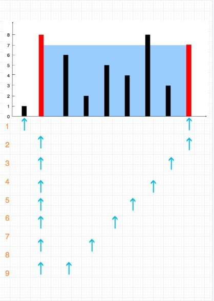

# 【Day 25】盛最多水的容器

## 题目描述

```markdown
给你 n 个非负整数 a1，a2，...，an，每个数代表坐标中的一个点 (i, ai) 。在坐标内画 n 条垂直线，垂直线 i 的两个端点分别为 (i, ai) 和 (i, 0)。找出其中的两条线，使得它们与 x 轴共同构成的容器可以容纳最多的水。

说明：你不能倾斜容器，且 n 的值至少为 2。


图中垂直线代表输入数组 [1,8,6,2,5,4,8,3,7]。在此情况下，容器能够容纳水（表示为蓝色部分）的最大值为 49。

示例：

输入：[1,8,6,2,5,4,8,3,7]
输出：49

来源：力扣（LeetCode）
链接：https://leetcode-cn.com/problems/container-with-most-water
著作权归领扣网络所有。商业转载请联系官方授权，非商业转载请注明出处。
```

## 我的回答

### 解法一

暴力循环两遍求最大面积

#### 时间复杂度 O(n^2) 两个循环

#### 空间复杂度 O(1) 创建了常数空间

```JavaScript
var maxArea = function(height) {
  let maxArea = 0;
  for (let i = 0; i < height.length; i++) {
    for (let j = 0; j < height.length; j++) {
      let area = Math.min(height[i], height[j]) * Math.abs(i - j);
      maxArea = Math.max(maxArea, area);
    }
  }
  return maxArea;
};
```

### 解法二

#### 时间复杂度 O(n) 双指针走完一个循环

#### 空间复杂度 O(1) 创建了 2 个常数空间

```JavaScript
var maxArea = function(height) {
  let maxArea = 0;
  let leftPointer = 0;
  let rightPointer = height.length - 1;
  while (leftPointer < rightPointer) {
    let area =
      Math.min(height[leftPointer], height[rightPointer]) *
      Math.abs(leftPointer - rightPointer);
    if (area > maxArea) maxArea = area;
    height[leftPointer] > height[rightPointer] ? rightPointer-- : leftPointer++;
  }
  return maxArea;
};
```

## 参考回答

> ## 题目地址
>
> https://leetcode-cn.com/problems/container-with-most-water/description/
>
> ## 前置知识
>
> - 双指针
>
> ## 思路
>
> 题目中说`找出其中的两条线，使得它们与 x 轴共同构成的容器可以容纳最多的水。` ，因此符合直觉的解法就是固定两个端点，计算可以承载的水量， 然后不断更新最大值，最后返回最大值即可。这种算法，需要两层循环，时间复杂度是 $O(n^2)$。
>
> 代码（JS）:
>
> ```JavaScript
> let max = 0;
> for (let i = 0; i < height.length; i++) {
>   for (let j = i + 1; j < height.length; j++) {
>     const currentArea = Math.abs(i - j) * Math.min(height[i], height[j]);
>     if (currentArea > max) {
>       max = currentArea;
>     }
>   }
> }
> return max;
> ```
>
> 虽然解法效率不高，但是可以通过（JS 可以通过，Python 不可以，其他语言没有尝试）。那么有没有更优的解法呢？
>
> 我们来换个角度来思考这个问题，上述的解法是通过两两组合，这无疑是完备的。我们换个角度思考，是否可以先计算长度为 n 的面积，然后计算长度为 n-1 的面积，... 计算长度为 1 的面积。 这样去不断更新最大值呢？很显然这种解法也是完备的，但是似乎时间复杂度还是 $O(n ^ 2)$, 不要着急。
>
> 考虑一下，如果我们计算 n-1 长度的面积的时候,是可以直接排除一半的结果的。
>
> 如图：
>
> > 
>
> 比如我们计算 n 面积的时候，假如左侧的线段高度比右侧的高度低，那么我们通过左移右指针来将长度缩短为 n-1 的做法是没有意义的，
> 因为`新的形成的面积变成了(n-1) * heightOfLeft 这个面积一定比刚才的长度为 n 的面积 （n * heightOfLeft） 小`。
>
> 也就是说**最大面积一定是当前的面积或者通过移动短的端点得到。**
>
> ## 关键点解析
>
> - 双指针优化时间复杂度
>
> ## 代码
>
> - 语言支持：JS，C++,Python
>
> JavaScript Code:
>
> ```JavaScript
> /**
>  * @param {number[]} height
>  * @return {number}
>  */
> var maxArea = function(height) {
>   if (!height || height.length <= 1) return 0;
>
>   let leftPos = 0;
>   let rightPos = height.length - 1;
>   let max = 0;
>   while (leftPos < rightPos) {
>     const currentArea =
>       Math.abs(leftPos - rightPos) *
>       Math.min(height[leftPos], height[rightPos]);
>     if (currentArea > max) {
>       max = currentArea;
>     }
>     // 更新小的
>     if (height[leftPos] < height[rightPos]) {
>       leftPos++;
>     } else {
>       // 如果相等就随便了
>       rightPos--;
>     }
>   }
>
>   return max;
> };
> ```
>
> C++ Code:
>
> ```c++
> class Solution {
> public:
>     int maxArea(vector<int>& height) {
>         auto ret = 0ul, leftPos = 0ul, rightPos = height.size() - 1;
>         while( leftPos < rightPos)
>         {
>             ret = std::max(ret, std::min(height[leftPos], height[rightPos]) * (rightPos - leftPos));
>            if (height[leftPos] < height[rightPos]) ++leftPos;
>             else --rightPos;
>         }
>         return ret;
>    }
> };
> ```
>
> Python Code:
>
> ```python
> class Solution:
>     def maxArea(self, heights):
>         l, r =  0, len(heights) - 1
>         ans = 0
>         while l < r:
>             ans = max(ans, (r - l) * min(heights[l], heights[r]))
>             if heights[r] > heights[l]:
>                 l += 1
>             else:
>                 r -= 1
>         return ans
> ```
>
> **_复杂度分析_**
>
> - 时间复杂度：由于左右指针移动的次数加起来正好是 n， 因此时间复杂度为 $O(N)$。
> - 空间复杂度：$O(1)$。
