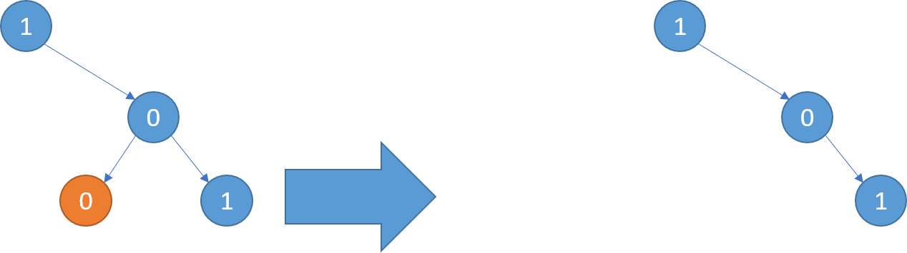
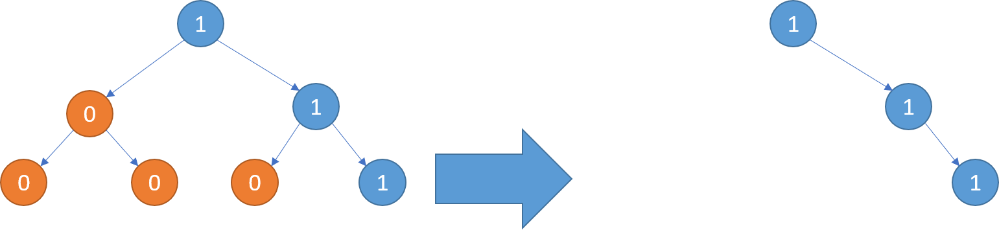
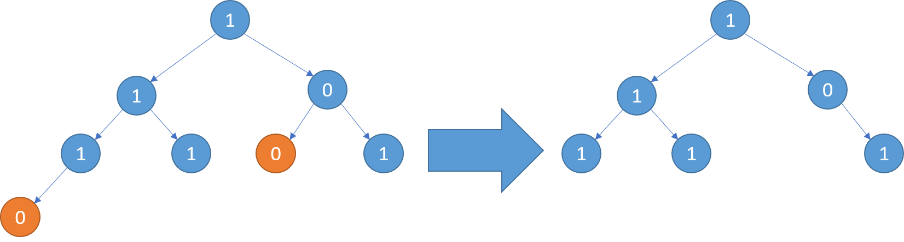

# 【进阶篇 - Day 48】 2020-12-18 - 814. 二叉树剪枝

## 题目描述

> ## 入选理由
>
> 1. 剪枝通常都是对递归树剪，最典型的就是回溯。而这道题就是树，让你形象化认识剪枝
>
> ## 题目描述
>
> 给定二叉树根结点 root ，此外树的每个结点的值要么是 0，要么是 1。
>
> 返回移除了所有不包含 1 的子树的原二叉树。
>
> ( 节点 X 的子树为 X 本身，以及所有 X 的后代。)
>
> 示例1:
> 输入: [1,null,0,0,1]
> 输出: [1,null,0,null,1]
>
> 解释:
> 只有红色节点满足条件“所有不包含 1 的子树”。
> 右图为返回的答案。
>
> [](https://user-images.githubusercontent.com/12479470/102567075-b87c2c00-411b-11eb-8cc5-301cf229a427.png)
>
> 示例2:
> 输入: [1,0,1,0,0,0,1]
> 输出: [1,null,1,null,1]
>
> [](https://user-images.githubusercontent.com/12479470/102567097-bfa33a00-411b-11eb-837d-c0e02985d220.png)
>
> 示例3:
> 输入: [1,1,0,1,1,0,1,0]
> 输出: [1,1,0,1,1,null,1]
>
> [](https://user-images.githubusercontent.com/12479470/102567105-c6ca4800-411b-11eb-9a72-4103132a3251.png)
>
> 说明:
>
> 给定的二叉树最多有 100 个节点。
> 每个节点的值只会为 0 或 1 。
>
> 来源：力扣（LeetCode）
> 链接：https://leetcode-cn.com/problems/binary-tree-pruning
> 著作权归领扣网络所有。商业转载请联系官方授权，非商业转载请注明出处。

## 我的回答

### 解法一

#### 时空复杂度

时间复杂度：O(n)

空间复杂度:   O(1)

```js
var pruneTree = function (root) {
    if (!root) return null
    root.left = pruneTree(root.left)
    root.right = pruneTree(root.right)
    if (!root.left && !root.right && root.val == 0) return null
    return root
};
```


## 参考回答

- 
