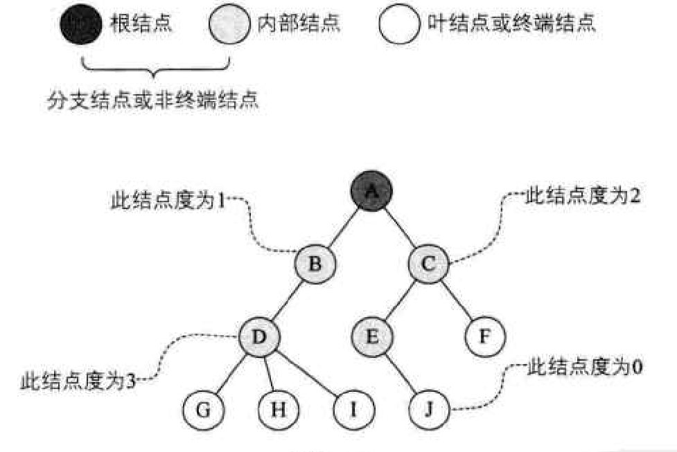
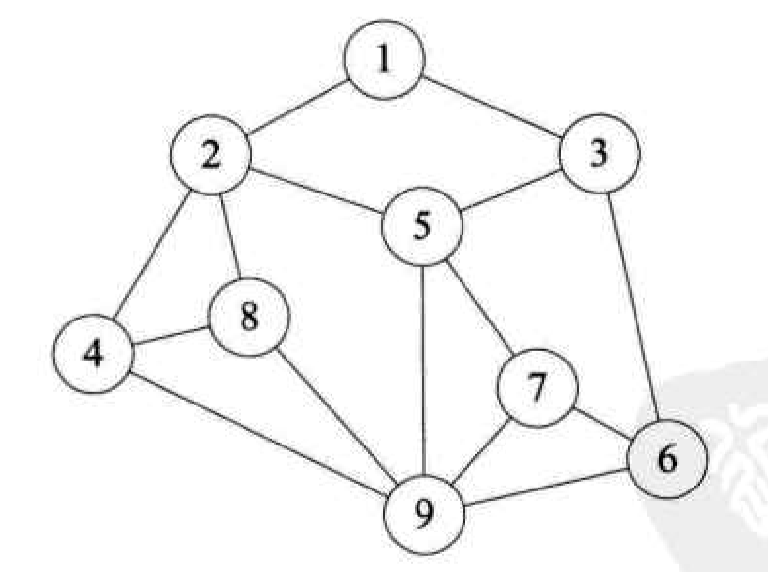

# 数据结构基础

## 逻辑结构

### 集合结构

集合结构中的数据元素除了同属于一个集合外，他们之间没有其他关系，都是平等的。

### 线性结构

线性结构中的数据元素之间**都是** 一对一的关系

### 树形结构

树形结构中的数据元素之间**存在** 一对多的关系

### 图形结构

图形结构中的数据元素之间是 多对多的关系

## 物理结构（存储结构）

指的是在数据的逻辑结构在计算机的存储形势

数据元素的存储结构形式有两种：`顺序存储`和`链式存储`

### 顺序存储结构

顺序存储机构：是把数据元素存放在地址**连续的**存储单元里，其数据间的逻辑关系和物理关系是**一致的**

### 链式存储结构

链式存储结构 ： 是把数据元素存放在地址**任意的**存储单元里，可以是连续的也可以是不连续的。需要一个指针存放数据元素的地址

## 线性表

### 顺序存储结构

线性表的顺序存储结构，在存、读数据时，不管是哪个位置，时间复杂度都是 0(1);
而插入或删除时，时间复杂度都是 0(n)。这就说明，它比较适合元素个数不太变化，而更多是存取数据的应用。
当然，它的优缺点还不只这些……

优点：

1. 无须为表示表中元素之间的逻辑关系而增加额外的存储空间
2. 可以快速地存取表中任一位置的元素

缺点：

1. 插入和删除操作需要移动大量元素
2. 当线性表长度变化较大时，难以确定存储空间的容量
3. 造成存储空间的“碎片”

### 链式存储结构

#### 单链表

顺序存储结构最大的缺点就是插入和删除时需要移动大量元素，链式结构用了无序存储+存储上一个元素地址的方式实现了快速插入和删除。

我们把存储数据元素信息的域称为`数据域`，把存储直接后继位置的域称为`指针域`。指针域中存储的信息称做`指针或链`。这两部分信息组成数据元素 ai 的存储映像，称为结点（`Node`)。

n 个结点（a1 的存储映像）链结成一个`链表`，即为线性表（a1,a2,…，an)的链式存储结构，因为此链表的每个结点中只包含一个`指针域`，所以叫做`单链表`。

我们把链表中**第一个**结点的存储位置叫做**头指针**，也规定了线性链表的最后一个结点指针为“空”

有时，我们为了更加方便地对链表进行操作，会在单链表的第一个结点前附设一个结点，称为头结点。头结点的数据域可以不存储任何信息，谁叫它是第一个呢

##### 头指针与头结点的异同点

###### 头指针

- 头指针是指链表指向第一个结点的指针，若链表有头结点，则是指向头结点的指针
- 头指针具有标识作用，所以常用头指针冠以链表的名字
- 无论链表是否为空，头指针均不为空。头指针是链表的必要
  元素

###### 头结点

- 头结点是为了操作的统一和方便而设立的，放在第一元素的结点之前，其数据域一般无意义（也可存放链表的长度）
- 有了头结点，对在第一元素结点前插入结点和删除第一结点，其操作与其它结点的操作就统一了
- 头结点不一定是链表必须要素

##### 优缺点对比

###### 存储分配方式：

- 顺序存储结构用一段连续的存储单元依次存储线性表的数据元素
- 单链表采用链式存储结构，用一组任意的存储单元存放线性表的元素

###### 时间性能

- 查找
  - 顺序存储结构 0(1)
  - 单链表 0(n)
- 插入和删除
  - 顺序存储结构需要平均移动表长一半的元素，时间为 0(n)
  - 单链表在线出某位置的指针后，插入和删除时间仅为 0(1)

###### 空间性能

- 顺序存储结构需要预分配存储空间，分大了，浪费，分小了易发生上溢
- 单链表不需要分配存储空间，只要有就可以分配，元素个数也不受限制

##### 总结

若线性表需要频繁查找，很少进行插入和删除操作时，宜采用顺序存储结构。若需要频繁插入和删除时，宜采用单链表结构。

当线性表中的元素个数变化较大或者根本不知道有多大时，最好用单链表结构，这样可以不需要考虑存储空间的大小问题。
而如果事先知道线性表的大致长度，用顺序存储结构效率会高很多。

#### 静态链表

有人就想出来用数组来代替指针，来描述单链表。真是不得不佩服他们的智慧，我们来看看他是怎么做到的。
首先我们让数组的元素都是由两个数据域组成，data 和 cur。也就是说，数组的每个下标都对应一个 data 和一个 cur。数据域 data,用来存放数据元素，也就是通常我们要处理的数据；而游标 cur 相当于单链表中的 next 指针，存放该元素的后继在数组中的下标。
我们把这种用数组描述的链表叫做静态链表，这种描述方法还有起名叫做游标实现法。

##### 优点：

1. 在插入和删除操作时，只需要修改游标，不需要移动元素，从而改进了在顺序存储结构中的插入和删除操作需要移动大量元素的缺点

##### 缺点：

1. 没有解决连续存储分配带来的表长难以确定的问题
2. 失去了顺序存储结构随机存取的特性

#### 循环链表

将单链表中终端结点的指针端由空指针改为指向头结点，就使整个单链表形成一个环，这种头尾相接的单链表称为`单循环链表`，简称`循环链表`（circular linkedlist)。

#### 双向链表

为了克服单向性这一缺点，我们的老科学家们，设计出了双向链表。**双向链表(double linked list)是在单链表的每个结点中，再设置一个指向其前驱结点的指针域。**所以在双向链表中的结点都有两个指针域，一个指向直接后继，另一个指向直接前驱。

### React Fiber

`fiber` 出现的目的其实是为了解决 `react` 在执行的时候是无法停下来的，需要一口气执行完的问题的。

[《为什么 React Fiber 使用链表遍历组件树》](https://github.com/dawn-plex/translate/blob/master/articles/the-how-and-why-on-reacts-usage-of-linked-list-in-fiber-to-walk-the-components-tree.md)

## 栈和队列

栈是限定**仅在表尾**进行`插入`和`删除`操作的线性表。

队列是只允许在一端进行插入操作、而在另一端进行删除操作的线性表。

### 栈

我们把允许插入和删除的一端称为`栈顶`（top),另一端称为`栈底`（bottom),不含任何数据元素的栈称为`空栈`。栈又称为**后进先出**（Last In First Out)的线性表，简称 **LIFO** 结构。

栈的插入和删除操作，我们改名为 `push` 和 `pop`,英文直译的话是压和弹，我们一般叫进栈和出栈。

栈根据存储结构分为顺序存储结构和链式存储结构，优缺点和之前的一样，但是栈的引入是为了简化程序设计问题，划分了不同关注层次，使思考范围缩小。比如我们无需像数组一样考虑下标的增删问题。

#### 栈的应用--递归

递归程序最怕的就是陷入永不结束的无穷递归中，所以，**每个递归定义必须至少有一个条件，满足时递归不再进行，即不再引用自身而是返回值退出**。

#### 栈的应用- 四则运算

### 队列

队列（queue)是只允许在一端进行插入操作，而在另一端进行删除操作的线性表。

**队列是一种先进先出（First In First Out)的线性表，简称 FIFO。允许插入的一端称为队尾，允许删除的一端称为队头。**

### 总结

它们均可以用线性表的顺序存储结构来实现，但都存在着顺序存储的一些弊端。

因此它们各自有各自的技巧来解决这个问题。
对于栈来说，如果是两个相同数据类型的栈，则可以用数组的两端作栈底的方法来让两个栈共享数据，这就可以最大化地利用数组的空间。
对于队列来说，为了避免数组插入和删除时需要移动数据，于是就引入了循环队列，使得队头和队尾可以在数组中循环变化。解决了移动数据的时间损耗，使得本来插入和删除是 0(n)的时间复杂度变成了 0(1)。

它们也都可以通过链式存储结构来实现，实现原则上与线性表基本相同

## 字符串

串（string)是由零个或多个字符组成的有限序列，又名叫字符串。

### ASCII 和 Unicode

计算机中的常用字符是使用标准的 `ASCII` 编码，更准确一点，由 7 位二进制数表示一个字符，总共可以表示 128 个字符。后来发现一些特殊符号的出现，128 个不够用，于是扩展 `ASCII` 码由 8 位二进制数表示一个字符，总共可以表示 256 个字符，这已经足够满足以英语为主的语言和特殊符号进行输入、存储、输出等操作的字符需要了。可是，单我们国家就有除汉族外的满、回、藏、蒙古、维吾尔等多个少数民族文字，换作全世界估计要有成百上千种语言与文字，显然这 256 个字符是不够的，因此后来就有了 `Unicode` 编码，比较常用的是由 16 位的二进制数表示一个字符，这样总共就可以表示 216 个字符，约是 65 万多个字符，足够表示世界上所有语言的所有字符了。当然，为了和 `ASCII` 码兼容，`Unicode` 的前 256 个字符与 `ASCII` 码完全相同。

**字符串之间比较大小是通过逐个比对字符的编码进行的。**

### 串的顺序存储结构

串的顺序存储结构是用一组地址连续的存储单元来存储串中的字符序列的。按照预定义的大小，为每个定义的串变量分配一个固定长度的存储区。一般是用定长数组来定义。

### 串的链式存储结构

对于串的链式存储结构，与线性表是相似的，但由于串结构的特殊性，结构中的每个元素数据是一个字符，如果也简单的应用链表存储串值，一个结点对应一个字符，就会存在很大的空间浪费。因此，一个结点可以存放一个字符，也可以考虑存放多个字符，最后一个结点若是未被占满时，可以用“#”或其他非串值字符补全
 //  TODO

### KMP 模式匹配算法

```jS


```


## 树

之前我们一直在谈的是一对一的线性结构，可现实中，还有很多一对多的情况需要处理，所以我们需要研究这种**一对多的数据结构——“树”，**

对于树的定义需要强调两点：
1.n>0时根结点是唯一的，不可能存在多个根结点，别和现实中的大树混在一起，现实中的树有很多根须，那是真实的树，数据结构中的树是**只能有一个根结点**。
2.m&gt;0时，子树的个数没有限制，但它们一定是互不相交的。像下图的两个结构就不符合树的定义，因为它们都有相交的子树。


### 数的基础

#### 节点分类 

树的结点包含一个数据元素及若干指向其子树的分支。结点拥有的子树数称为结点的度（Degree)。度为0的结点称为叶结点（Leaf)或终端结点；度不为0的结点称为非终端结点或分支结点。除根结点之外，分支结点也称为内部结点。树的度是树内各结点的度的最大值。



#### 节点之间的关系

结点的子树的根称为该结点的孩子（Child),相应地，该结点称为孩子的双亲(Parent)。同一个双亲的孩子之间互称兄弟（Sibling)。结点的祖先是从根到该结点所经分支上的所有结点。

#### 其他

结点的层次（Level)从根开始定义起，根为第一层，根的孩子为第二层。

树中结点的最大层次称为树的深度（Depth)或高度，当前树的深度为4。

如果将树中结点的各子树看成从左至右是有次序的，不能互换的，则称该树为有序树，否则称为无序树。

### 树的存储结构

#### 双亲表示法

每个节点中都会附设一个指示器指示其双亲节点到链表中的位置。但是这样只方便查找其父节点，当parent 为-1时表示找到了树的根。

幸运的是树节点的存储设计是个灵活的过程，但你想要关注节点的兄弟只要增加一个右兄弟域来记录右兄弟下标。还有双亲域、长子域。

**存储结构的设计是一个非常灵活的过程。一个存储结构设计得是否合理，取决于基于该存储结构的运算是否适合、是否方便，时**
**间复杂度好不好等。注意也不是越多越好，有需要时再设计相应的结构。**

// TODO 树的存储结构

#### 孩子表示法

换一种完全不同的考虑方法。由于树中每个结点可能有多棵子树，可以考虑用多重链表，即每个结点有多个指针域，其中每个指针指向一棵子树的根结点，我们把这种方法叫做`多重链表表示法`。

#### 双亲孩子表示法


### 二叉树

二叉树的特点有：

1. 每个结点最多有两棵子树，所以二叉树中不存在度大于2的结点。注意不是只有两棵子树，而是最多有。没有子树或者有一棵子树都是可以的。

2. 左子树和右子树是有顺序的，次序不能任意颠倒。就像人是双手、双脚，但显然左手、左脚和右手、右脚是不一样的，右手戴左手套、右脚穿左鞋都会极其别扭和难受。
3. 即使树中某结点只有一棵子树，也要区分它是左子树还是右子树。

##### 特殊二叉树

- ​	**斜树**。顾名思义，斜树一定要是斜的，但是往哪斜还是有讲究。所有的结点都只有左子树的二叉树叫左斜树。所有结点都是只有右子树的二叉树叫右斜树。
- **满二叉树**。在一棵二叉树中，如果所有分支结点都存在左子树和右子树，并且所有叶子都在同一层上，这样的二叉树称为满二叉树。


- **完全二叉树**。对一棵具有n个结点的二叉树按层序编号，如果编号为i(1≤i≤n)的结点与同样深度的满二叉树中编号为i的结点在二叉树中位置完全相同，则这棵二叉树称为完全二叉树，


首先从字面上要区分，“完全”和“满”的差异，满二叉树一定是一棵完全二叉树，但完全二叉树不一定是满的。数字有断层了就不是完全二叉树了。

#### 二叉树性质

1. **在二叉树的第1层上至多有 2^(i-1)个结点（i≥1)。**
2. **深度为k的二叉树至多有(2^k) - 1个结点（k≥1)。**
3. **对任何一棵二叉树T,如果其终端结点数为no,度为2的结点数为n2,则no=n2+1。**
4. **具有n个结点的完全二叉树的深度为[log2n]+1(Lx]表示不大于x的最大整数）。**

#### 遍历二叉树

1. **前序遍历**
   规则是若二叉树为空，则空操作返回，否则先访问根结点，然后前序遍历左子树，再前序遍历右子树。如图所示，遍历的顺序为：ABDGHCEIF。


2. **中序遍历**
   规则是若树为空，则空操作返回，否则从根结点开始（注意并不是先访问根结点）,中序遍历根结点的左子树，然后是访问根结点，最后中序遍历右子树。如图所示，遍历的顺序为：GDHBAEICF。


3. **后序遍历**
   规则是若树为空，则空操作返回，否则从左到右先叶子后结点的方式遍历访问左右子树，最后是访问根结点。如图所示，遍历的顺序为：GHDBIEFCA。


4. **层序遍历**
   规则是若树为空，则空操作返回，否则从树的第一层，也就是根结点开始访问，从上而下逐层遍历，在同一层中，按从左到右的顺序对结点逐个访问。如图所示，遍历的顺序为：ABCDEFGHI。


// TODO 四种遍历算法

// TODO线索二叉树

// TODO 树、森林和二叉树的转换

#### 遍历算法

#### 线索二叉树

#### 树、森林和二叉树的转换

#### 赫夫曼树及其应用

## 图



**图（Graph)是由顶点的有穷非空集合和顶点之间边的集合组成，通常表示为：G(V,E),其中，G表示一个图，V是图G中顶点的集合，E是图G中边的集合。**

对于图的定义，我们需要明确几个注意的地方。

1. 线性表中我们把数据元素叫元素，树中将数据元素叫结点，**在图中数据元素，我们则称之为顶点（Vertex)。**
2. 线性表中可以没有数据元素，称为空表。树中可以没有结点，叫做空树。
3. 线性表中，相邻的数据元素之间具有线性关系，树结构中，相邻两层的结点具有层次关系，而图中，**任意两个顶点之间都可能有关系，顶点之间的逻辑关系用边来表示**，边集可以是空的。


**有向边：若从顶点 v1到 V2的边有方向，则称这条边为有向边，也称为弧（Arc)。**与之对应的叫无向边

有很少条边或弧的图称为稀疏图，反之称为稠密图。这里稀疏和稠密是模糊的概念，都是**相对而言**的。

有些图的边或弧具有与它相关的数字，这种与图的边或弧相关的数叫做**权(Weight)**。这些权可以表示从一个顶点到另一个顶点的距离或耗费。这种**带权的图通常称为网（Network)。**


图按照有无方向分为**无向图**和**有向图**。无向图由**顶点**和**边**构成，有向图由**顶点**和**弧**构成。弧有**弧尾**和**弧头**之分。
图按照边或弧的多少分**稀疏图**和**稠密图**。如果任意两个顶点之间都存在边叫**完全图**，有向的叫**有向完全图**。若无重复的边或顶点到自身的边则叫**简单图**。
图中顶点之间有邻接点、依附的概念。无向图顶点的边数叫做**度**，有向图顶点分为**入度**和**出度**。

图上的边或弧上带权则称为**网**。

图中顶点间存在路径，两顶点存在路径则说明是连通的，如果路径最终回到起始点则称为**环**，当中不重复叫**简单路径**。若任意两顶点都是连通的，则图就是**连通图**，有向则称**强连通图**。图中有子图，若子图极大连通则就是连通分量，有向的则称**强连通分量**。

无向图中连通且n个顶点n-1条边叫**生成树**。有向图中一顶点入度为0其余顶点入度为1的叫**有向树**。一个有向图由若干棵有向树构成生成森林。