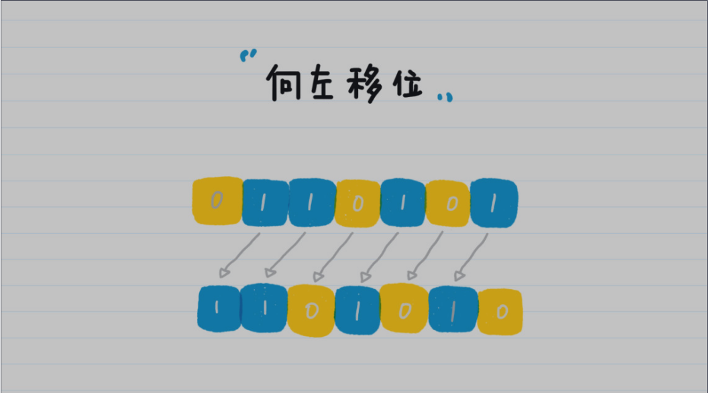

# 算法数学基础

其中 ^ 表示幂或次方运算。十进制的数位（千位、百位、十位等）全部都是 10^n 的形式。需要特别注意的是，任何非 0 数字的 0 次方均为 1。在这个新的表示式里，10 被称为十进制计数法的基数，也是十进制中“十”的由来。

## 二进制

**二进制的数位就是 2^n 的形式**。

### **计算机为什么使用二进制？**

组成计算机系统的逻辑电路通常只有两个状态，即开关的接通与断开。断开的状态我们用“0”来表示，接通的状态用“1”来表示。

另外，二进制也非常适合逻辑运算。逻辑运算中的“真”和“假”，正好与二进制的“0”和“1”两个数字相对应。逻辑运算中的加法（“或”运算）、乘法（“与”运算）以及否定（“非”运算）都可以通过“0”和“1”的加法、乘法和减法来实现。

### **二进制的位操作**

#### **向左移位**

在这个例子中，如果将 1101010 换算为十进制，就是 106，你有没有发现，106 正好是53 的 2 倍。所以，我们可以得出一个结论：**二进制左移一位，其实就是将数字翻倍**。

#### **向右移位**

二进制 110101 向右移一位，就是去除末尾的那一位，因此 110101 就变成了 11010（最前面的 0 可以省略）。我们将 11010 换算为十进制，就是 26，正好是 53 除以 2 的整数商。所以**二进制右移一位，就是将数字除以 2 并求整数商的操作**

**左移位是 <<，那右移位为什么是 >>> 而不是 >> 呢？**实际上，>> 也是右移操作。简

单来说，之所以有这两种表达方式，根本原因是 Java 的二进制数值中最高一位是符号位。

## 余数

**同余定理**：两个整数 a和 b，如果它们除以正整数 m 得到的余数相等，我们就可以说 a 和 b 对于模 m 同余。

简单来说，**同余定理其实就是用来分类的**。你知道，我们有无穷多个整数，那怎么能够全面、多维度地管理这些整数？同余定理就提供了一个思路。因为不管你的模是几，最终得到的余数肯定都在一个范围内。

哈希（Hash）你应该不陌生，在每个编程语言中，都会有对应的哈希函数。哈希有的时候也会被翻译为散列，简单来说，它就是**将任意长度的输入，通过哈希算法，压缩为某一固定长度的输出**。

## 迭代法

**迭代法，简单来说，其实就是不断地用旧的变量值，递推计算新的变量值**。

### **具体应用**

- **求数值的精确或者近似解**。典型的方法包括二分法（Bisection method）和牛顿迭代法

（Newton’s method）。

- **在一定范围内查找目标值。**典型的方法包括二分查找。
- **机器学习算法中的迭代**。相关的算法或者模型有很多，比如 K- 均值算法（K-means 

clustering）、PageRank 的马尔科夫链（Markov chain）、梯度下降法（Gradient 

descent）等等。迭代法之所以在机器学习中有广泛的应用，是因为**很多时候机器学习**

**的过程，就是根据已知的数据和一定的假设，求一个局部最优解**。而迭代法可以帮助学

习算法逐步搜索，直至发现这种解。

## **数学归纳法**

在棋盘上放麦粒的规则是，第一格放一粒，第二格放两粒，以此类推，每一小格内都比前一小格多一倍的麦子，直至放满 64 个格子。

我们小时候都玩过“找规律”，于是，我发现了这么一个规律，前 n个格子的麦粒总数就是2^n - 1

这个假设是否成立，我们还有待验证。但是对于类似这种无穷数列的问题，我们通常可以采用**数学归纳法**（Mathematical Induction）来证明。